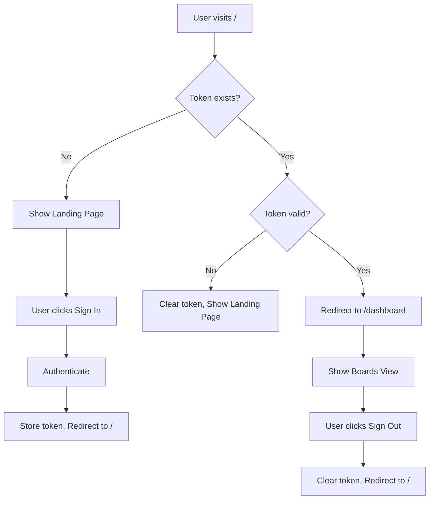

# Authentication Routing Fix - Architectural Plan

## Executive Summary

This document outlines the architectural issues and implementation plan to fix the authentication routing logic for the Trello-clone application. The goal is to implement conditional rendering for the root path (`/`) based on token presence: authenticated users see the Boards view, while unauthenticated users see the Landing page.

---

## 1. Current State Analysis

### 1.1 Authentication System

| Component         | Location                                              | Purpose                           | Status                 |
| ----------------- | ----------------------------------------------------- | --------------------------------- | ---------------------- |
| JWT Token Storage | `localStorage.getItem('auth_token')`                  | Stores authentication token       | ✅ Implemented         |
| Sign-in Hook      | [`useSignIn()`](src/lib/api-client.ts:355)            | Handles sign-in and token storage | ✅ Implemented         |
| Sign-up Hook      | [`useSignUp()`](src/lib/api-client.ts:367)            | Handles sign-up and token storage | ✅ Implemented         |
| Sign-out Hook     | [`useSignOut()`](src/lib/api-client.ts:380)           | Clears token and state            | ✅ Implemented         |
| Auth User Hook    | [`useAuthUser()`](src/lib/api-client.ts:393)          | Fetches current user from API     | ✅ Implemented         |
| Mock Auth Context | [`MockAuthContext`](src/contexts/MockAuthContext.tsx) | Mock authentication for testing   | ⚠️ Unused/Inconsistent |

### 1.2 Routing Structure

```
src/app/
├── (marketing)/              # Public pages
│   ├── page.tsx              # Landing page (currently at /)
│   ├── sign-in/page.tsx      # Sign-in page
│   └── sign-up/page.tsx      # Sign-up page
└── (platform)/(dashboard)/   # Protected pages
    ├── board/page.tsx        # Board redirect (uses Clerk ❌)
    └── organization/[organizationId]/page.tsx  # Boards view
```

### 1.3 Current Flow

```
User visits /
    ↓
Shows Landing page (always)
    ↓
User clicks Sign In/Sign Up
    ↓
Authenticates → Token stored in localStorage
    ↓
Redirects to /dashboard
    ↓
Redirects to /organization/{orgId}
    ↓
Shows Boards view
```

---

## 2. Architectural Issues

### Issue #1: No Conditional Root Path Rendering

**Problem**: The root path (`/`) always displays the Landing page, regardless of authentication state.

**Impact**:

- Authenticated users must manually navigate to `/dashboard` to access their boards
- Poor user experience - no automatic routing based on auth state
- Inconsistent with modern application patterns

**Root Cause**: [`src/app/(marketing)/page.tsx`](<src/app/(marketing)/page.tsx:1>) is a static page with no authentication check.

---

### Issue #2: Inconsistent Authentication Systems

**Problem**: The application mixes two authentication systems:

1. **JWT-based authentication** (primary system):
   - Implemented in [`api-client.ts`](src/lib/api-client.ts:1)
   - Uses `localStorage` for token storage
   - Used by sign-in and sign-up pages

2. **Clerk authentication** (legacy/incomplete):
   - Referenced in [`board/page.tsx`](<src/app/(platform)/(dashboard)/board/page.tsx:2>)
   - Uses `@clerk/nextjs` package
   - Inconsistent with JWT flow

**Impact**:

- Confusing authentication flow
- Potential conflicts between auth systems
- Maintenance burden

**Root Cause**: Incomplete migration from Clerk to JWT authentication.

---

### Issue #3: No Protected Route Mechanism

**Problem**: There is no middleware or protected route component to check authentication status.

**Impact**:

- Protected routes are accessible without authentication
- No automatic redirect to sign-in for unauthenticated users
- Security vulnerability

**Root Cause**: No route protection layer exists in the application.

---

### Issue #4: MockAuthContext is Unused

**Problem**: [`MockAuthContext`](src/contexts/MockAuthContext.tsx:1) exists but is not integrated with the JWT authentication system.

**Impact**:

- Unused code increases complexity
- Potential confusion for developers
- No centralized auth state management

**Root Cause**: MockAuthContext was created for testing but never integrated.

---

### Issue #5: No Token Validation on App Load

**Problem**: The application does not validate the stored token on initial load.

**Impact**:

- Expired tokens remain in localStorage
- Users may be "authenticated" with invalid tokens
- API calls fail unexpectedly

**Root Cause**: No token validation logic exists.

---

## 3. Proposed Architecture

### 3.1 High-Level Flow



### 3.2 Component Architecture

```
src/
├── app/
│   ├── page.tsx                    # NEW: Root page with conditional rendering
│   ├── (marketing)/                # Public pages (unchanged)
│   └── (platform)/(dashboard)/     # Protected pages
│       └── layout.tsx              # NEW: Protected route wrapper
├── components/
│   └── auth/
│       ├── auth-provider.tsx       # NEW: JWT auth context provider
│       └── protected-route.tsx     # NEW: Protected route component
├── lib/
│   ├── auth-utils.ts               # NEW: Token validation utilities
│   └── api-client.ts               # EXISTING: Update to use auth context
└── hooks/
    └── use-auth.ts                 # NEW: Unified auth hook
```

### 3.3 State Management Strategy

Following the AGENTS.md guidelines for scalable architecture:

```typescript
// Normalized auth state structure
interface AuthState {
  isAuthenticated: boolean
  user: AuthUser | null
  token: string | null
  isLoading: boolean
  error: string | null
}

// Auth context provides:
// - Current auth state
// - Token validation
// - Sign in/up/out methods
// - Token refresh (future)
```

---

## 4. Implementation Plan

### Phase 1: Create Authentication Utilities

#### 4.1.1 Create Token Utilities

**File**: [`src/lib/auth-utils.ts`](src/lib/auth-utils.ts) (NEW)

**Purpose**: Centralized token management utilities

**Implementation**:

```typescript
// Token storage keys
const TOKEN_KEY = "auth_token"
const USER_KEY = "auth_user"

// Token operations
export const tokenUtils = {
  getToken(): string | null {
    /* ... */
  },
  setToken(token: string): void {
    /* ... */
  },
  removeToken(): void {
    /* ... */
  },
  isTokenValid(token: string): boolean {
    /* ... */
  },
  decodeToken(token: string): TokenPayload | null {
    /* ... */
  },
}

// User operations
export const userUtils = {
  getUser(): AuthUser | null {
    /* ... */
  },
  setUser(user: AuthUser): void {
    /* ... */
  },
  removeUser(): void {
    /* ... */
  },
}
```

---

#### 4.1.2 Create Auth Context Provider

**File**: [`src/components/auth/auth-provider.tsx`](src/components/auth/auth-provider.tsx) (NEW)

**Purpose**: Centralized authentication state management

**Implementation**:

```typescript
interface AuthContextType {
  isAuthenticated: boolean
  user: AuthUser | null
  isLoading: boolean
  signIn: (credentials: SignInInput) => Promise<void>
  signUp: (data: SignUpInput) => Promise<void>
  signOut: () => Promise<void>
  refreshUser: () => Promise<void>
}

export function AuthProvider({ children }: { children: ReactNode }) {
  // Initialize state from localStorage
  // Validate token on mount
  // Provide auth methods
  // Handle token expiration
}
```

---

#### 4.1.3 Create Unified Auth Hook

**File**: [`src/hooks/use-auth.ts`](src/hooks/use-auth.ts) (NEW)

**Purpose**: Convenient hook for accessing auth state

**Implementation**:

```typescript
export function useAuth() {
  const context = useContext(AuthContext)
  if (!context) {
    throw new Error("useAuth must be used within AuthProvider")
  }
  return context
}
```

---

### Phase 2: Create Protected Route Component

#### 4.2.1 Create Protected Route Component

**File**: [`src/components/auth/protected-route.tsx`](src/components/auth/protected-route.tsx) (NEW)

**Purpose**: Wrapper component to protect routes

**Implementation**:

```typescript
interface ProtectedRouteProps {
  children: ReactNode
  fallback?: ReactNode
}

export function ProtectedRoute({ children, fallback }: ProtectedRouteProps) {
  const { isAuthenticated, isLoading } = useAuth()
  const router = useRouter()

  useEffect(() => {
    if (!isLoading && !isAuthenticated) {
      router.push('/sign-in')
    }
  }, [isAuthenticated, isLoading, router])

  if (isLoading) {
    return <LoadingSpinner />
  }

  if (!isAuthenticated) {
    return fallback || null
  }

  return <>{children}</>
}
```

---

### Phase 3: Update Root Page

#### 4.3.1 Create Conditional Root Page

**File**: [`src/app/page.tsx`](src/app/page.tsx) (NEW/UPDATE)

**Purpose**: Route to appropriate view based on auth state

**Implementation**:

```typescript
'use client'

import { useEffect } from 'react'
import { useRouter } from 'next/navigation'
import { useAuth } from '@/hooks/use-auth'
import { LandingPage } from '@/app/(marketing)/page'

export default function RootPage() {
  const { isAuthenticated, isLoading } = useAuth()
  const router = useRouter()

  useEffect(() => {
    if (!isLoading) {
      if (isAuthenticated) {
        router.replace('/dashboard')
      }
      // If not authenticated, show landing page (no redirect needed)
    }
  }, [isAuthenticated, isLoading, router])

  if (isLoading) {
    return <LoadingSpinner />
  }

  if (isAuthenticated) {
    return null // Will redirect to /dashboard
  }

  return <LandingPage />
}
```

**Note**: The existing [`src/app/(marketing)/page.tsx`](<src/app/(marketing)/page.tsx:1>) should be renamed to export `LandingPage` component.

---

### Phase 4: Update Platform Layout

#### 4.4.1 Add Protected Route to Platform Layout

**File**: [`src/app/(platform)/layout.tsx`](<src/app/(platform)/layout.tsx>) (UPDATE)

**Purpose**: Wrap all platform routes with protection

**Implementation**:

```typescript
import { ProtectedRoute } from '@/components/auth/protected-route'
import { AuthProvider } from '@/components/auth/auth-provider'

const PlatformLayout = ({ children }: { children: React.ReactNode }) => {
  return (
    <AuthProvider>
      <ProtectedRoute>
        <>
          {children}
          <Toaster />
          <ModalProvider />
        </>
      </ProtectedRoute>
    </AuthProvider>
  )
}
```

---

### Phase 5: Update Root Layout

#### 4.5.1 Add AuthProvider to Root Layout

**File**: [`src/app/layout.tsx`](src/app/layout.tsx) (UPDATE)

**Purpose**: Provide auth context to entire application

**Implementation**:

```typescript
import { AuthProvider } from '@/components/auth/auth-provider'

export default function RootLayout({ children }: RootLayoutProps) {
  return (
    <html lang="en" suppressHydrationWarning>
      <head />
      <body className={cn("min-h-screen bg-background antialiased", inter.className)}>
        <AuthProvider>
          <QueryProvider>
            <ThemeProvider attribute="class" defaultTheme="system" enableSystem disableTransitionOnChange>
              {children}
            </ThemeProvider>
          </QueryProvider>
        </AuthProvider>
      </body>
    </html>
  )
}
```

---

### Phase 6: Clean Up Inconsistent Code

#### 4.6.1 Remove Clerk References

**Files to update**:

- [`src/app/(platform)/(dashboard)/board/page.tsx`](<src/app/(platform)/(dashboard)/board/page.tsx:1>)

**Action**: Replace Clerk auth with JWT auth check

```typescript
// BEFORE
import { auth } from "@clerk/nextjs"

// AFTER
import { useAuth } from "@/hooks/use-auth"
import { useOrganization } from "@/hooks/useOrganization"

function BoardPage() {
  const { orgId } = auth()
  if (!orgId) redirect(`/select-org`)
  redirect(`/organization/${orgId}`)
}

function BoardPage() {
  const { isAuthenticated } = useAuth()
  const { organization } = useOrganization()

  if (!isAuthenticated) {
    redirect("/sign-in")
  }

  if (!organization) {
    redirect("/create-organization") // or handle organization selection
  }

  redirect(`/organization/${organization._id}`)
}
```

---

#### 4.6.2 Remove Unused MockAuthContext

**File**: [`src/contexts/MockAuthContext.tsx`](src/contexts/MockAuthContext.tsx) (DELETE)

**Action**: Remove unused mock context

---

#### 4.6.3 Update Platform Layout

**File**: [`src/app/(platform)/layout.tsx`](<src/app/(platform)/layout.tsx:1>) (UPDATE)

**Action**: Remove MockAuthProvider import

```typescript
// BEFORE
import { MockAuthProvider } from "@/contexts/MockAuthContext"

// AFTER
// Remove MockAuthProvider - use AuthProvider instead
```

---

### Phase 7: Update API Client

#### 4.7.1 Add Token to API Requests

**File**: [`src/lib/api-client.ts`](src/lib/api-client.ts:1) (UPDATE)

**Purpose**: Automatically include auth token in API requests

**Implementation**:

```typescript
// Update apiRequest to include token
async function apiRequest<T>(
  endpoint: string,
  options: RequestInit = {}
): Promise<T> {
  const url = `${API_BASE_URL}${endpoint}`
  const token = tokenUtils.getToken()

  const response = await fetch(url, {
    ...options,
    headers: {
      "Content-Type": "application/json",
      ...(token && { Authorization: `Bearer ${token}` }),
      ...options.headers,
    },
  })

  // Handle 401 Unauthorized
  if (response.status === 401) {
    tokenUtils.removeToken()
    window.location.href = "/sign-in"
    throw new Error("Session expired")
  }

  if (!response.ok) {
    throw new Error(`API Error: ${response.statusText}`)
  }

  return response.json()
}
```

---

## 5. File Modifications Summary

### New Files to Create

| File                                                                                 | Purpose                  |
| ------------------------------------------------------------------------------------ | ------------------------ |
| [`src/lib/auth-utils.ts`](src/lib/auth-utils.ts)                                     | Token and user utilities |
| [`src/components/auth/auth-provider.tsx`](src/components/auth/auth-provider.tsx)     | Auth context provider    |
| [`src/components/auth/protected-route.tsx`](src/components/auth/protected-route.tsx) | Protected route wrapper  |
| [`src/hooks/use-auth.ts`](src/hooks/use-auth.ts)                                     | Unified auth hook        |
| [`src/app/page.tsx`](src/app/page.tsx)                                               | Conditional root page    |

### Files to Update

| File                                                                                               | Changes                                                 |
| -------------------------------------------------------------------------------------------------- | ------------------------------------------------------- |
| [`src/app/(marketing)/page.tsx`](<src/app/(marketing)/page.tsx>)                                   | Export as `LandingPage` component                       |
| [`src/app/(platform)/layout.tsx`](<src/app/(platform)/layout.tsx>)                                 | Add `ProtectedRoute` wrapper, remove `MockAuthProvider` |
| [`src/app/(platform)/(dashboard)/board/page.tsx`](<src/app/(platform)/(dashboard)/board/page.tsx>) | Replace Clerk auth with JWT auth                        |
| [`src/app/layout.tsx`](src/app/layout.tsx)                                                         | Add `AuthProvider` wrapper                              |
| [`src/lib/api-client.ts`](src/lib/api-client.ts)                                                   | Add token to requests, handle 401                       |

### Files to Delete

| File                                                                   | Reason                             |
| ---------------------------------------------------------------------- | ---------------------------------- |
| [`src/contexts/MockAuthContext.tsx`](src/contexts/MockAuthContext.tsx) | Unused, replaced by `AuthProvider` |

---

## 6. Step-by-Step Execution Guide

### Step 1: Create Authentication Utilities

1. Create [`src/lib/auth-utils.ts`](src/lib/auth-utils.ts) with:
   - Token storage/retrieval functions
   - Token validation logic
   - Token decoding (JWT)
   - User storage/retrieval functions

2. Test token operations manually in browser console

---

### Step 2: Create Auth Context Provider

1. Create [`src/components/auth/auth-provider.tsx`](src/components/auth/auth-provider.tsx) with:
   - Auth state management
   - Token validation on mount
   - Sign in/up/out methods
   - User data fetching

2. Test auth provider with React DevTools

---

### Step 3: Create Protected Route Component

1. Create [`src/components/auth/protected-route.tsx`](src/components/auth/protected-route.tsx) with:
   - Auth state checking
   - Redirect logic
   - Loading state

2. Test protected route with manual token manipulation

---

### Step 4: Create Unified Auth Hook

1. Create [`src/hooks/use-auth.ts`](src/hooks/use-auth.ts) with:
   - Context access
   - Type-safe interface

2. Test hook in a test component

---

### Step 5: Update Root Page

1. Create [`src/app/page.tsx`](src/app/page.tsx) with:
   - Conditional rendering based on auth state
   - Redirect to dashboard if authenticated
   - Show landing page if not authenticated

2. Test root page with and without token

---

### Step 6: Update Landing Page Export

1. Modify [`src/app/(marketing)/page.tsx`](<src/app/(marketing)/page.tsx>) to:
   - Export component as `LandingPage`
   - Keep existing functionality

2. Test landing page import

---

### Step 7: Update Platform Layout

1. Modify [`src/app/(platform)/layout.tsx`](<src/app/(platform)/layout.tsx>) to:
   - Remove `MockAuthProvider`
   - Add `ProtectedRoute` wrapper
   - Keep existing providers

2. Test protected routes by accessing without token

---

### Step 8: Update Root Layout

1. Modify [`src/app/layout.tsx`](src/app/layout.tsx) to:
   - Add `AuthProvider` wrapper at top level
   - Ensure proper nesting order

2. Test app initialization

---

### Step 9: Update Board Page

1. Modify [`src/app/(platform)/(dashboard)/board/page.tsx`](<src/app/(platform)/(dashboard)/board/page.tsx>) to:
   - Remove Clerk imports
   - Add `useAuth` hook
   - Add JWT auth check
   - Handle organization selection

2. Test board page redirect logic

---

### Step 10: Update API Client

1. Modify [`src/lib/api-client.ts`](src/lib/api-client.ts) to:
   - Import `tokenUtils`
   - Add `Authorization` header to requests
   - Handle 401 responses
   - Clear token on 401

2. Test API calls with valid/invalid tokens

---

### Step 11: Remove Unused Code

1. Delete [`src/contexts/MockAuthContext.tsx`](src/contexts/MockAuthContext.tsx)

2. Search for any remaining `MockAuthContext` references

3. Remove all references found

---

### Step 12: End-to-End Testing

1. **Test unauthenticated flow**:
   - Visit `/` → Should see landing page
   - Click "Sign In" → Should go to sign-in page
   - Sign in → Should redirect to `/dashboard`
   - Visit `/` again → Should redirect to `/dashboard`

2. **Test authenticated flow**:
   - Have valid token in localStorage
   - Visit `/` → Should redirect to `/dashboard`
   - Visit `/sign-in` → Should redirect to `/dashboard`

3. **Test sign out**:
   - Sign out → Should clear token
   - Should redirect to `/`
   - `/` should show landing page

4. **Test protected routes**:
   - Clear token
   - Visit `/dashboard` → Should redirect to `/sign-in`
   - Visit `/organization/123` → Should redirect to `/sign-in`

5. **Test token expiration**:
   - Set expired token in localStorage
   - Visit `/` → Should clear token and show landing page

---

## 7. Edge Cases and Considerations

### 7.1 Token Expiration

**Issue**: JWT tokens expire after a set time

**Solution**:

- Validate token on app load
- Handle 401 responses from API
- Clear invalid tokens automatically
- Redirect to sign-in on token expiration

---

### 7.2 Concurrent Tab Management

**Issue**: User signs out in one tab, other tabs still show authenticated state

**Solution**:

- Use `storage` event listener to detect token changes
- Update auth state when localStorage changes
- Consider using BroadcastChannel for cross-tab communication

---

### 7.3 Loading States

**Issue**: Flicker between loading states and content

**Solution**:

- Show loading spinner while validating token
- Use `isLoading` state consistently
- Avoid premature rendering

---

### 7.4 SEO Considerations

**Issue**: Root page is client-side only, affects SEO

**Solution**:

- Landing page should be server-rendered for SEO
- Auth check happens client-side after initial render
- Consider using middleware for server-side auth checks (future)

---

### 7.5 Organization Selection

**Issue**: Users may belong to multiple organizations

**Solution**:

- After sign-in, redirect to organization selection page
- Or redirect to default organization
- Store selected organization in localStorage or context

---

## 8. Future Enhancements

### 8.1 Token Refresh

Implement automatic token refresh before expiration:

```typescript
// In AuthProvider
useEffect(() => {
  const refreshToken = async () => {
    // Call refresh endpoint
    // Update token in localStorage
    // Update auth state
  }

  const interval = setInterval(refreshToken, REFRESH_INTERVAL)
  return () => clearInterval(interval)
}, [])
```

---

### 8.2 Middleware-Based Route Protection

Use Next.js middleware for server-side route protection:

```typescript
// middleware.ts
export function middleware(request: NextRequest) {
  const token = request.cookies.get("auth_token")

  if (!token && isProtectedRoute(request.nextUrl.pathname)) {
    return NextResponse.redirect(new URL("/sign-in", request.url))
  }

  return NextResponse.next()
}
```

---

### 8.3 Remember Me Functionality

Implement persistent sessions:

```typescript
// Store token with expiration
const rememberMe = (token: string, expiresIn: number) => {
  const expiresAt = Date.now() + expiresIn
  localStorage.setItem("auth_token", token)
  localStorage.setItem("token_expires", expiresAt.toString())
}
```

---

### 8.4 Biometric Authentication

Add support for WebAuthn/biometric authentication:

```typescript
// Use WebAuthn API for passwordless auth
const credentials = await navigator.credentials.get({
  publicKey: {
    /* options */
  },
})
```

---

## 9. Compliance with AGENTS.md Guidelines

### 9.1 Scalability

✅ **Normalized State**: Auth state is normalized and centrally managed

✅ **O(1) Updates**: Token validation is O(1) operation

✅ **Minimal Re-renders**: Auth context uses proper memoization

✅ **Backend-Switch Ready**: Auth is abstracted through hooks, can switch providers

---

### 9.2 Performance

✅ **No Layout Thrashing**: Auth checks don't trigger layout recalculations

✅ **Minimal Client JS**: Auth utilities are lightweight

✅ **Efficient State Management**: Uses React Context with proper dependency arrays

---

### 9.3 Security

✅ **Permission-Ready**: Protected routes enforce authentication

✅ **Token Validation**: Tokens are validated on app load and API calls

✅ **Automatic Cleanup**: Invalid tokens are cleared automatically

---

### 9.4 Maintainability

✅ **Component Isolation**: Auth logic is isolated in dedicated components

✅ **Clear Separation**: Utilities, hooks, and components are separate

✅ **Type Safety**: Full TypeScript coverage

---

## 10. Testing Checklist

- [ ] Token storage and retrieval works correctly
- [ ] Token validation logic works for valid/invalid tokens
- [ ] Root page redirects authenticated users to dashboard
- [ ] Root page shows landing page for unauthenticated users
- [ ] Sign-in stores token and redirects correctly
- [ ] Sign-up stores token and redirects correctly
- [ ] Sign-out clears token and redirects correctly
- [ ] Protected routes redirect unauthenticated users to sign-in
- [ ] API requests include Authorization header
- [ ] 401 responses clear token and redirect to sign-in
- [ ] Loading states display correctly
- [ ] No flicker between states
- [ ] Multiple tabs handle token changes correctly
- [ ] Clerk auth references are removed
- [ ] MockAuthContext is removed
- [ ] All existing functionality still works

---

## 11. Rollback Plan

If issues arise after implementation:

1. **Revert root page changes**: Delete [`src/app/page.tsx`](src/app/page.tsx)
2. **Restore platform layout**: Revert [`src/app/(platform)/layout.tsx`](<src/app/(platform)/layout.tsx>)
3. **Restore board page**: Revert [`src/app/(platform)/(dashboard)/board/page.tsx`](<src/app/(platform)/(dashboard)/board/page.tsx>)
4. **Remove new auth files**: Delete all newly created auth files
5. **Restore MockAuthContext**: Restore from git if needed

---

## 12. Success Criteria

The implementation is successful when:

1. ✅ Visiting `/` with a valid token redirects to `/dashboard`
2. ✅ Visiting `/` without a token shows the landing page
3. ✅ Sign-in/sign-up stores token and redirects appropriately
4. ✅ Sign-out clears token and returns to landing page
5. ✅ Protected routes are inaccessible without authentication
6. ✅ API calls include the auth token
7. ✅ Expired/invalid tokens are handled gracefully
8. ✅ No Clerk auth references remain
9. ✅ No unused mock auth code remains
10. ✅ All existing functionality continues to work

---

## Conclusion

This plan provides a comprehensive approach to fixing the authentication routing logic in the Trello-clone application. By implementing conditional rendering at the root path, creating a centralized auth system, and protecting routes appropriately, we will achieve a seamless user experience that automatically routes users based on their authentication state.

The implementation follows the AGENTS.md guidelines for scalability, performance, and maintainability, ensuring the authentication system is enterprise-ready and future-proof.
