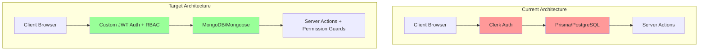

# Clerk to JWT + MongoDB Migration Plan

## Executive Summary

This document outlines the comprehensive migration strategy to transition the Taskify Trello-clone from:

- **Authentication**: Clerk → Custom JWT-based authentication
- **Database**: Prisma/PostgreSQL → MongoDB with Mongoose
- **Authorization**: Clerk org management → Custom RBAC system
- **Password Hashing**: argon2id → Bun's `password.hash`

---

## Current State Analysis

### Authentication Stack (Clerk)

- `@clerk/nextjs` v4.31.8 for authentication
- `@clerk/themes` v1.7.20 for UI theming
- Clerk components: `<SignIn>`, `<SignUp>`, `<UserButton>`, `<OrganizationSwitcher>`
- Clerk hooks: `useOrganization()`, `useOrganizationList()`, `auth()`, `currentUser()`
- Clerk middleware for route protection

### Database Stack (Prisma/PostgreSQL)

- `@prisma/client` v5.8.1
- `prisma` v5.8.1 (dev dependency)
- PostgreSQL database
- Schema includes: Board, List, Card, AuditLog, OrgLimit

### Key Integration Points

| Component                                                                                                                              | Clerk Usage                                  | Prisma Usage           |
| -------------------------------------------------------------------------------------------------------------------------------------- | -------------------------------------------- | ---------------------- |
| [`src/middleware.ts`](src/middleware.ts)                                                                                               | `authMiddleware()`, `redirectToSignIn()`     | -                      |
| [`src/components/auth-provider.tsx`](src/components/auth-provider.tsx)                                                                 | `<ClerkProvider>`                            | -                      |
| [`src/app/(platform)/(clerk)/sign-in/[[...sign-in]]/page.tsx`](<src/app/(platform)/(clerk)/sign-in/[[...sign-in]]/page.tsx>)           | `<SignIn>`, `auth()`                         | -                      |
| [`src/app/(platform)/(clerk)/sign-up/[[...sign-in]]/page.tsx`](<src/app/(platform)/(clerk)/sign-up/[[...sign-in]]/page.tsx>)           | `<SignUp>`, `auth()`                         | -                      |
| [`src/app/(platform)/(dashboard)/_components/dashboard-navbar.tsx`](<src/app/(platform)/(dashboard)/_components/dashboard-navbar.tsx>) | `<UserButton>`, `<OrganizationSwitcher>`     | -                      |
| [`src/app/(platform)/(dashboard)/_components/sidebar.tsx`](<src/app/(platform)/(dashboard)/_components/sidebar.tsx>)                   | `useOrganization()`, `useOrganizationList()` | -                      |
| All server actions in [`src/actions/`](src/actions/)                                                                                   | `auth()`, `currentUser()`                    | `db.*` queries         |
| [`src/lib/create-audit-log.ts`](src/lib/create-audit-log.ts)                                                                           | `auth()`, `currentUser()`                    | `db.auditLog.create()` |
| [`src/lib/org-limit.ts`](src/lib/org-limit.ts)                                                                                         | `auth()`                                     | `db.orgLimit.*`        |

---

## Architecture Diagram



---

## RBAC Architecture

### Role-Based Access Control Design

Following the AGENTS.md principles for permission-ready design, we implement a granular RBAC system that supports:

- **Organization-level roles** (Owner, Admin, Member, Guest)
- **Board-level permissions** (View, Edit, Delete, Manage)
- **List-level restrictions** (Read-only, Edit, Archive)
- **Card-level visibility** (Public, Private, Restricted)

### Permission Matrix

| Role       | Org Level      | Board Level        | List Level         | Card Level         |
| ---------- | -------------- | ------------------ | ------------------ | ------------------ |
| **Owner**  | Full Control   | Full Control       | Full Control       | Full Control       |
| **Admin**  | Manage Members | Full Control       | Full Control       | Full Control       |
| **Member** | View Only      | Create/Edit/Delete | Create/Edit/Delete | Create/Edit/Delete |
| **Guest**  | View Only      | View Only          | View Only          | View Only          |

### Permission Enumerations

```typescript
// Organization Roles
enum OrgRole {
  OWNER = "owner",
  ADMIN = "admin",
  MEMBER = "member",
  GUEST = "guest",
}

// Board Permissions
enum BoardPermission {
  VIEW = "board:view",
  EDIT = "board:edit",
  DELETE = "board:delete",
  MANAGE = "board:manage",
}

// List Permissions
enum ListPermission {
  VIEW = "list:view",
  EDIT = "list:edit",
  DELETE = "list:delete",
  ARCHIVE = "list:archive",
}

// Card Permissions
enum CardPermission {
  VIEW = "card:view",
  EDIT = "card:edit",
  DELETE = "card:delete",
  MOVE = "card:move",
  COPY = "card:copy",
}

// Action Types for Audit
enum AuditAction {
  CREATE = "create",
  UPDATE = "update",
  DELETE = "delete",
  MOVE = "move",
  COPY = "copy",
  ARCHIVE = "archive",
  RESTORE = "restore",
  ASSIGN = "assign",
  COMMENT = "comment",
}
```

### Permission Guard Pattern

```typescript
// Permission check function signature
interface PermissionCheck {
  userId: string
  orgId: string
  resource: "board" | "list" | "card"
  resourceId: string
  action: string
}

// Returns true if user has permission
async function checkPermission(params: PermissionCheck): Promise<boolean>
```

---

## Migration Phases

### Phase 1: Setup MongoDB and Remove Prisma

**Objective**: Replace Prisma with Mongoose and MongoDB

#### Tasks:

1. Install MongoDB dependencies

   ```bash
   npm install mongoose
   npm install -D @types/mongoose
   ```

2. Remove Prisma dependencies

   ```bash
   npm uninstall @prisma/client prisma
   ```

3. Create MongoDB connection utility
   - File: [`src/lib/mongodb.ts`](src/lib/mongodb.ts)
   - Implement singleton connection pattern
   - Handle connection errors gracefully

4. Create MongoDB schema directory
   - Directory: [`src/models/`](src/models/)
   - Create models: User, Organization, Board, List, Card, AuditLog, OrgLimit, Permission

5. Update environment variables
   - Add `MONGODB_URI`
   - Remove `DATABASE_URL`, `DIRECT_URL`

#### Files to Create:

- [`src/lib/mongodb.ts`](src/lib/mongodb.ts) - MongoDB connection singleton
- [`src/models/User.ts`](src/models/User.ts) - User model
- [`src/models/Organization.ts`](src/models/Organization.ts) - Organization model
- [`src/models/Board.ts`](src/models/Board.ts) - Board model
- [`src/models/List.ts`](src/models/List.ts) - List model
- [`src/models/Card.ts`](src/models/Card.ts) - Card model
- [`src/models/AuditLog.ts`](src/models/AuditLog.ts) - AuditLog model
- [`src/models/OrgLimit.ts`](src/models/OrgLimit.ts) - OrgLimit model

#### Files to Delete:

- [`src/prisma/schema.prisma`](src/prisma/schema.prisma)
- [`src/prisma/`](src/prisma/) directory

---

### Phase 2: Implement JWT Authentication Infrastructure

**Objective**: Build custom JWT-based authentication system with Bun password hashing

#### Tasks:

1. Install JWT dependencies

   ```bash
   npm install jsonwebtoken
   npm install -D @types/jsonwebtoken
   ```

2. Create JWT utilities
   - File: [`src/lib/jwt.ts`](src/lib/jwt.ts)
   - Implement `generateToken()`, `verifyToken()`, `decodeToken()`
   - Use RS256 or HS256 algorithm
   - Set appropriate token expiration (e.g., 7 days for access, 30 days for refresh)

3. Create password hashing utilities (using Bun)
   - File: [`src/lib/password.ts`](src/lib/password.ts)
   - Implement `hashPassword()` using `Bun.password.hash()`
   - Implement `verifyPassword()` using `Bun.password.verify()`
   - Use argon2id algorithm (default in Bun)

4. Create authentication context
   - File: [`src/contexts/AuthContext.tsx`](src/contexts/AuthContext.tsx)
   - Provide user, organization, and auth state
   - Implement login, logout, refresh token functions

5. Create custom auth hooks
   - File: [`src/hooks/useAuth.ts`](src/hooks/useAuth.ts)
   - File: [`src/hooks/useOrganization.ts`](src/hooks/useOrganization.ts)
   - File: [`src/hooks/useOrganizationList.ts`](src/hooks/useOrganizationList.ts)
   - File: [`src/hooks/usePermissions.ts`](src/hooks/usePermissions.ts) - New RBAC hook

6. Create server-side auth utilities
   - File: [`src/lib/server-auth.ts`](src/lib/server-auth.ts)
   - Implement `getAuthUser()`, `getAuthOrg()` for server actions
   - Implement `verifyAuthCookie()` for middleware

7. Create RBAC utilities
   - File: [`src/lib/rbac.ts`](src/lib/rbac.ts)
   - Implement permission checking logic
   - Implement role-based permission resolution
   - Implement permission guard functions

#### Files to Create:

- [`src/lib/jwt.ts`](src/lib/jwt.ts) - JWT token generation/verification
- [`src/lib/password.ts`](src/lib/password.ts) - Password hashing utilities (Bun)
- [`src/contexts/AuthContext.tsx`](src/contexts/AuthContext.tsx) - Client auth context
- [`src/hooks/useAuth.ts`](src/hooks/useAuth.ts) - useAuth hook
- [`src/hooks/useOrganization.ts`](src/hooks/useOrganization.ts) - useOrganization hook
- [`src/hooks/useOrganizationList.ts`](src/hooks/useOrganizationList.ts) - useOrganizationList hook
- [`src/hooks/usePermissions.ts`](src/hooks/usePermissions.ts) - usePermissions hook (RBAC)
- [`src/lib/server-auth.ts`](src/lib/server-auth.ts) - Server-side auth utilities
- [`src/lib/rbac.ts`](src/lib/rbac.ts) - RBAC permission utilities

---

### Phase 3: Migrate Database Models to MongoDB

**Objective**: Convert Prisma schema to Mongoose models with RBAC support

#### Model Mappings:

##### User Model

```typescript
// src/models/User.ts
{
  _id: ObjectId,
  email: string (unique, indexed),
  password: string (hashed with Bun),
  firstName: string,
  lastName: string,
  imageUrl: string,
  organizations: ObjectId[] (ref: Organization),
  createdAt: Date,
  updatedAt: Date
}
```

##### Organization Model

```typescript
// src/models/Organization.ts
{
  _id: ObjectId,
  name: string,
  slug: string (unique, indexed),
  ownerId: ObjectId (ref: User),
  members: [{
    userId: ObjectId (ref: User),
    role: enum (OWNER, ADMIN, MEMBER, GUEST),
    joinedAt: Date
  }],
  createdAt: Date,
  updatedAt: Date
}
```

##### Board Model

```typescript
// src/models/Board.ts
{
  _id: ObjectId,
  orgId: ObjectId (ref: Organization, indexed),
  title: string,
  imageId: string,
  imageThumbUrl: string,
  imageUsername: string,
  imageHtmlLink: string,
  imageFullUrl: string,
  // RBAC: Board-level permissions
  permissions: {
    view: [ObjectId], // User IDs who can view
    edit: [ObjectId], // User IDs who can edit
    delete: [ObjectId], // User IDs who can delete
    manage: [ObjectId] // User IDs who can manage
  },
  createdAt: Date,
  updatedAt: Date
}
```

##### List Model

```typescript
// src/models/List.ts
{
  _id: ObjectId,
  title: string,
  position: string (fractional indexing for better reordering),
  boardId: ObjectId (ref: Board, indexed),
  cards: ObjectId[] (ref: Card),
  // RBAC: List-level restrictions
  isArchived: boolean,
  permissions: {
    view: [ObjectId],
    edit: [ObjectId],
    delete: [ObjectId],
    archive: [ObjectId]
  },
  createdAt: Date,
  updatedAt: Date
}
```

##### Card Model

```typescript
// src/models/Card.ts
{
  _id: ObjectId,
  title: string,
  position: string (fractional indexing),
  description: string,
  listId: ObjectId (ref: List, indexed),
  // Advanced features from AGENTS.md
  priority: enum (LOW, MEDIUM, HIGH, URGENT),
  labels: [{
    id: string,
    name: string,
    color: string,
    description: string
  }],
  assignees: [ObjectId] (ref: User),
  dueDate: Date,
  isArchived: boolean,
  // RBAC: Card-level visibility
  visibility: enum (PUBLIC, PRIVATE, RESTRICTED),
  allowedViewers: [ObjectId],
  // AI-ready metadata
  aiMetadata: {
    summary?: string,
    embeddingId?: string,
    autoTags?: string[]
  },
  // Activity timeline
  activity: [{
    id: string,
    type: enum (MOVE, EDIT, COMMENT, ASSIGN),
    userId: ObjectId,
    timestamp: Date,
    metadata: object
  }],
  createdAt: Date,
  updatedAt: Date
}
```

##### AuditLog Model

```typescript
// src/models/AuditLog.ts
{
  _id: ObjectId,
  entityId: string,
  entityTitle: string,
  orgId: ObjectId (ref: Organization, indexed),
  userId: ObjectId (ref: User, indexed),
  userImage: string,
  username: string,
  entityType: enum (BOARD, LIST, CARD),
  action: enum (CREATE, UPDATE, DELETE, MOVE, COPY, ARCHIVE, RESTORE, ASSIGN, COMMENT),
  // Enhanced audit trail for compliance
  metadata: {
    changes?: object,
    previousState?: object,
    newState?: object,
    ipAddress?: string,
    userAgent?: string
  },
  createdAt: Date,
  updatedAt: Date
}
```

##### OrgLimit Model

```typescript
// src/models/OrgLimit.ts
{
  _id: ObjectId,
  orgId: ObjectId (ref: Organization, unique, indexed),
  count: number,
  // Tier-based limits
  tier: enum (FREE, PRO, ENTERPRISE),
  limits: {
    maxBoards: number,
    maxMembers: number,
    maxCardsPerBoard: number,
    maxListsPerBoard: number
  },
  createdAt: Date,
  updatedAt: Date
}
```

#### Tasks:

1. Create all Mongoose models with proper indexes
2. Add TypeScript types for each model
3. Implement virtual fields and instance methods as needed
4. Add pre-save hooks for timestamps
5. Add fractional indexing utilities for position fields
6. Add RBAC indexes for permission arrays

---

### Phase 4: Update Server Actions to Use JWT and RBAC

**Objective**: Replace Clerk auth with JWT auth and add permission guards

#### Files to Update:

| File                                                                                     | Changes Required                                                                     |
| ---------------------------------------------------------------------------------------- | ------------------------------------------------------------------------------------ |
| [`src/actions/get-board/index.ts`](src/actions/get-board/index.ts)                       | Replace `auth()` with `getAuthUser()`, add permission check                          |
| [`src/actions/create-board/index.ts`](src/actions/create-board/index.ts)                 | Replace `auth()` with `getAuthUser()`, add permission check                          |
| [`src/actions/update-board/index.ts`](src/actions/update-board/index.ts)                 | Replace `auth()` with `getAuthUser()`, add permission check                          |
| [`src/actions/delete-board/index.ts`](src/actions/delete-board/index.ts)                 | Replace `auth()` with `getAuthUser()`, add permission check                          |
| [`src/actions/create-list/index.ts`](src/actions/create-list/index.ts)                   | Replace `auth()` with `getAuthUser()`, add permission check                          |
| [`src/actions/update-list/index.ts`](src/actions/update-list/index.ts)                   | Replace `auth()` with `getAuthUser()`, add permission check                          |
| [`src/actions/delete-list/index.ts`](src/actions/delete-list/index.ts)                   | Replace `auth()` with `getAuthUser()`, add permission check                          |
| [`src/actions/update-list-position/index.ts`](src/actions/update-list-position/index.ts) | Replace `auth()` with `getAuthUser()`, add permission check, use fractional indexing |
| [`src/actions/create-card/index.ts`](src/actions/create-card/index.ts)                   | Replace `auth()` with `getAuthUser()`, add permission check                          |
| [`src/actions/update-card/index.ts`](src/actions/update-card/index.ts)                   | Replace `auth()` with `getAuthUser()`, add permission check                          |
| [`src/actions/delete-card/index.ts`](src/actions/delete-card/index.ts)                   | Replace `auth()` with `getAuthUser()`, add permission check                          |
| [`src/actions/update-card-position/index.ts`](src/actions/update-card-position/index.ts) | Replace `auth()` with `getAuthUser()`, add permission check, use fractional indexing |
| [`src/actions/copy-card/index.ts`](src/actions/copy-card/index.ts)                       | Replace `auth()` with `getAuthUser()`, add permission check                          |
| [`src/actions/copy-list/index.ts`](src/actions/copy-list/index.ts)                       | Replace `auth()` with `getAuthUser()`, add permission check                          |

#### Library Files to Update:

| File                                                         | Changes Required                                                              |
| ------------------------------------------------------------ | ----------------------------------------------------------------------------- |
| [`src/lib/create-audit-log.ts`](src/lib/create-audit-log.ts) | Replace `auth()`, `currentUser()` with `getAuthUser()`, add enhanced metadata |
| [`src/lib/org-limit.ts`](src/lib/org-limit.ts)               | Replace `auth()` with `getAuthUser()`                                         |

#### Code Pattern Change:

**Before (Clerk):**

```typescript
import { auth, currentUser } from "@clerk/nextjs"

const { userId, orgId } = auth()
const user = await currentUser()
```

**After (JWT + RBAC):**

```typescript
import { checkPermission } from "@/lib/rbac"
import { getAuthUser } from "@/lib/server-auth"

const { userId, orgId, user } = await getAuthUser()

// Check permission before action
const hasPermission = await checkPermission({
  userId,
  orgId,
  resource: "board",
  resourceId: boardId,
  action: "board:edit",
})

if (!hasPermission) {
  return { error: "Forbidden", statusCode: 403 }
}
```

#### New Server Actions to Create:

- [`src/actions/invite-member/index.ts`](src/actions/invite-member/index.ts) - Invite user to organization
- [`src/actions/update-member-role/index.ts`](src/actions/update-member-role/index.ts) - Update member role
- [`src/actions/remove-member/index.ts`](src/actions/remove-member/index.ts) - Remove member from org
- [`src/actions/set-board-permissions/index.ts`](src/actions/set-board-permissions/index.ts) - Set board-level permissions
- [`src/actions/set-list-permissions/index.ts`](src/actions/set-list-permissions/index.ts) - Set list-level permissions
- [`src/actions/set-card-visibility/index.ts`](src/actions/set-card-visibility/index.ts) - Set card visibility

---

### Phase 5: Update Client Components to Use Custom Auth

**Objective**: Replace Clerk components and hooks with custom auth

#### Components to Update:

##### 1. Auth Provider

**File:** [`src/components/auth-provider.tsx`](src/components/auth-provider.tsx)

**Before:**

```tsx
import { ClerkProvider } from "@clerk/nextjs"

export function AuthProvider({ children }: { children: React.ReactNode }) {
  return <ClerkProvider>{children}</ClerkProvider>
}
```

**After:**

```tsx
"use client"

import { AuthProvider as CustomAuthProvider } from "@/contexts/AuthContext"

export function AuthProvider({ children }: { children: React.ReactNode }) {
  return <CustomAuthProvider>{children}</CustomAuthProvider>
}
```

##### 2. Dashboard Navbar

**File:** [`src/app/(platform)/(dashboard)/_components/dashboard-navbar.tsx`](<src/app/(platform)/(dashboard)/_components/dashboard-navbar.tsx>)

**Changes:**

- Remove `<OrganizationSwitcher>` component
- Remove `<UserButton>` component
- Replace with custom organization switcher and user menu
- Use `useAuth()` and `useOrganization()` hooks

##### 3. Sidebar

**File:** [`src/app/(platform)/(dashboard)/_components/sidebar.tsx`](<src/app/(platform)/(dashboard)/_components/sidebar.tsx>)

**Changes:**

- Replace `useOrganization()` with custom hook
- Replace `useOrganizationList()` with custom hook
- Update organization list rendering
- Add role indicators for each organization

##### 4. Sidebar Item

**File:** [`src/app/(platform)/(dashboard)/_components/sidebar-item.tsx`](<src/app/(platform)/(dashboard)/_components/sidebar-item.tsx>)

**Changes:**

- Update TypeScript types for Organization
- Remove Clerk-specific props
- Add role badge display

##### 5. Board Components

**File:** [`src/app/(platform)/(dashboard)/board/_components/list-container.tsx`](<src/app/(platform)/(dashboard)/board/_components/list-container.tsx>)

**Changes:**

- Add permission checks before allowing drag/drop
- Use `usePermissions()` hook to check edit permissions
- Disable actions based on permissions

#### New Components to Create:

1. **Custom User Menu**
   - File: [`src/components/auth/user-menu.tsx`](src/components/auth/user-menu.tsx)
   - Dropdown menu with user profile, settings, logout

2. **Custom Organization Switcher**
   - File: [`src/components/auth/organization-switcher.tsx`](src/components/auth/organization-switcher.tsx)
   - Dropdown menu to switch between organizations
   - Show role badges for each org

3. **Custom Sign In Form**
   - File: [`src/components/auth/sign-in-form.tsx`](src/components/auth/sign-in-form.tsx)
   - Email/password form with validation

4. **Custom Sign Up Form**
   - File: [`src/components/auth/sign-up-form.tsx`](src/components/auth/sign-up-form.tsx)
   - Email/password/name form with validation
   - Organization creation on signup

5. **Member Management Modal**
   - File: [`src/components/auth/member-management-modal.tsx`](src/components/auth/member-management-modal.tsx)
   - Invite members, manage roles

6. **Permission Settings Panel**
   - File: [`src/components/auth/permission-settings-panel.tsx`](src/components/auth/permission-settings-panel.tsx)
   - Configure board/list/card permissions

---

### Phase 6: Update Middleware and Routing

**Objective**: Replace Clerk middleware with JWT-based middleware

#### File: [`src/middleware.ts`](src/middleware.ts)

**Before:**

```typescript
import { authMiddleware, redirectToSignIn } from "@clerk/nextjs"

export default authMiddleware({
  publicRoutes: ["/", "/tech-stack"],
  afterAuth(auth, req) {
    // Clerk auth logic
  },
})
```

**After:**

```typescript
import { NextResponse } from "next/server"

import { verifyAuthCookie } from "@/lib/server-auth"

export default async function middleware(req: NextRequest) {
  const publicRoutes = ["/", "/tech-stack", "/sign-in", "/sign-up"]
  const { pathname } = req.nextUrl

  if (publicRoutes.includes(pathname)) {
    const authUser = await verifyAuthCookie(req)
    if (authUser?.userId && authUser?.orgId) {
      return NextResponse.redirect(
        new URL(`/organization/${authUser.orgId}`, req.url)
      )
    }
    return NextResponse.next()
  }

  const authUser = await verifyAuthCookie(req)

  if (!authUser?.userId) {
    return NextResponse.redirect(new URL("/sign-in", req.url))
  }

  if (!authUser?.orgId && pathname !== "/select-org") {
    return NextResponse.redirect(new URL("/select-org", req.url))
  }

  return NextResponse.next()
}

export const config = {
  matcher: ["/((?!.+\\.[\\w]+$|_next).*)", "/", "/(api|trpc)(.*)"],
}
```

---

### Phase 7: Create Authentication UI

**Objective**: Build custom sign-in/sign-up pages

#### Files to Create/Update:

##### 1. Sign In Page

**File:** [`src/app/(platform)/sign-in/page.tsx`](<src/app/(platform)/sign-in/page.tsx>)

```tsx
import { redirect } from "next/navigation"

import { getAuthUser } from "@/lib/server-auth"
import { SignInForm } from "@/components/auth/sign-in-form"

export default async function SignInPage() {
  const authUser = await getAuthUser()
  if (authUser?.userId && authUser?.orgId) {
    redirect(`/organization/${authUser.orgId}`)
  }
  return <SignInForm />
}
```

##### 2. Sign Up Page

**File:** [`src/app/(platform)/sign-up/page.tsx`](<src/app/(platform)/sign-up/page.tsx>)

```tsx
import { redirect } from "next/navigation"

import { getAuthUser } from "@/lib/server-auth"
import { SignUpForm } from "@/components/auth/sign-up-form"

export default async function SignUpPage() {
  const authUser = await getAuthUser()
  if (authUser?.userId && authUser?.orgId) {
    redirect(`/organization/${authUser.orgId}`)
  }
  return <SignUpForm />
}
```

##### 3. Select Organization Page

**File:** [`src/app/(platform)/select-org/page.tsx`](<src/app/(platform)/select-org/page.tsx>)

```tsx
import { redirect } from "next/navigation"

import { getAuthUser } from "@/lib/server-auth"
import { OrganizationSelector } from "@/components/auth/organization-selector"

export default async function SelectOrgPage() {
  const authUser = await getAuthUser()
  if (!authUser?.userId) {
    redirect("/sign-in")
  }
  return <OrganizationSelector userId={authUser.userId} />
}
```

##### 4. Organization Settings Page

**File:** [`src/app/(platform)/(dashboard)/organization/[organizationId]/members/page.tsx`](<src/app/(platform)/(dashboard)/organization/[organizationId]/members/page.tsx>)

```tsx
import { redirect } from "next/navigation"

import { getAuthUser } from "@/lib/server-auth"
import { MemberManagement } from "@/components/auth/member-management"

export default async function MembersPage({
  params,
}: {
  params: { organizationId: string }
}) {
  const authUser = await getAuthUser()
  if (!authUser?.userId) {
    redirect("/sign-in")
  }
  return <MemberManagement orgId={params.organizationId} />
}
```

#### Files to Delete:

- [`src/app/(platform)/(clerk)/`](<src/app/(platform)/(clerk)/>) - Entire directory

---

### Phase 8: Update Environment Configuration

**Objective**: Update environment variables for JWT and MongoDB

#### File: [`src/env.mjs`](src/env.mjs)

**Before:**

```javascript
export const env = createEnv({
  client: {
    NEXT_PUBLIC_APP_URL: z.string().min(1),
    NEXT_PUBLIC_CLERK_PUBLISHABLE_KEY: z.string().min(1),
    NEXT_PUBLIC_CLERK_SIGN_IN_URL: z.string().min(1),
    NEXT_PUBLIC_CLERK_SIGN_UP_URL: z.string().min(1),
    NEXT_PUBLIC_CLERK_AFTER_SIGN_IN_URL: z.string().min(1),
    NEXT_PUBLIC_CLERK_AFTER_SIGN_UP_URL: z.string().min(1),
    NEXT_PUBLIC_UNSPLASH_ACCESS_KEY: z.string().min(1),
    NEXT_PUBLIC_UNSPLASH_SECRET_KEY: z.string().min(1),
  },
  runtimeEnv: {
    NEXT_PUBLIC_APP_URL: process.env.NEXT_PUBLIC_APP_URL,
    NEXT_PUBLIC_CLERK_PUBLISHABLE_KEY:
      process.env.NEXT_PUBLIC_CLERK_PUBLISHABLE_KEY,
    CLERK_SECRET_KEY: process.env.CLERK_SECRET_KEY,
    // ... other vars
    DATABASE_URL: process.env.DATABASE_URL,
    DIRECT_URL: process.env.DIRECT_URL,
  },
})
```

**After:**

```javascript
export const env = createEnv({
  client: {
    NEXT_PUBLIC_APP_URL: z.string().min(1),
    NEXT_PUBLIC_UNSPLASH_ACCESS_KEY: z.string().min(1),
    NEXT_PUBLIC_UNSPLASH_SECRET_KEY: z.string().min(1),
  },
  server: {
    MONGODB_URI: z.string().min(1),
    JWT_SECRET: z.string().min(32),
    JWT_REFRESH_SECRET: z.string().min(32),
  },
  runtimeEnv: {
    NEXT_PUBLIC_APP_URL: process.env.NEXT_PUBLIC_APP_URL,
    NEXT_PUBLIC_UNSPLASH_ACCESS_KEY:
      process.env.NEXT_PUBLIC_UNSPLASH_ACCESS_KEY,
    NEXT_PUBLIC_UNSPLASH_SECRET_KEY:
      process.env.NEXT_PUBLIC_UNSPLASH_SECRET_KEY,
    MONGODB_URI: process.env.MONGODB_URI,
    JWT_SECRET: process.env.JWT_SECRET,
    JWT_REFRESH_SECRET: process.env.JWT_REFRESH_SECRET,
  },
})
```

#### File: [`.env.example`](.env.example)

**Before:**

```env
NEXT_PUBLIC_APP_URL=http://localhost:3000

DATABASE_URL=
DIRECT_DATABASE_URL=

NEXT_PUBLIC_UNSPLASH_ACCESS_KEY=
NEXT_PUBLIC_UNSPLASH_SECRET_KEY=
```

**After:**

```env
NEXT_PUBLIC_APP_URL=http://localhost:3000

# MongoDB Connection
MONGODB_URI=mongodb://localhost:27017/taskify

# JWT Secrets (generate with: openssl rand -base64 32)
JWT_SECRET=
JWT_REFRESH_SECRET=

# Unsplash
NEXT_PUBLIC_UNSPLASH_ACCESS_KEY=
NEXT_PUBLIC_UNSPLASH_SECRET_KEY=
```

---

### Phase 9: Test and Validate Migration

**Objective**: Ensure all functionality works after migration

#### Testing Checklist:

##### Authentication Flow

- [ ] User can sign up with email/password
- [ ] User can sign in with email/password
- [ ] User can sign out
- [ ] Auth tokens are stored in cookies
- [ ] Auth tokens are validated on server
- [ ] Protected routes redirect to sign-in
- [ ] Authenticated users redirected from public routes
- [ ] Password hashing works with Bun's `password.hash`
- [ ] Password verification works with Bun's `password.verify`

##### Organization Management

- [ ] User can create organization on sign-up
- [ ] User can create additional organizations
- [ ] User can switch between organizations
- [ ] Organization list displays correctly
- [ ] Organization selector works
- [ ] Role badges display correctly

##### RBAC Functionality

- [ ] Owners have full control over organization
- [ ] Admins can manage members but not delete organization
- [ ] Members can create/edit boards but not manage org settings
- [ ] Guests have view-only access
- [ ] Board-level permissions work correctly
- [ ] List-level restrictions work correctly
- [ ] Card-level visibility works correctly
- [ ] Permission checks prevent unauthorized actions
- [ ] Permission errors return 403 status

##### Board Operations

- [ ] User can create board (with permission check)
- [ ] User can update board (with permission check)
- [ ] User can delete board (with permission check)
- [ ] Board limit enforced (2 free boards)
- [ ] Boards are scoped to organization
- [ ] Fractional indexing works for list ordering

##### List Operations

- [ ] User can create list (with permission check)
- [ ] User can update list (with permission check)
- [ ] User can delete list (with permission check)
- [ ] User can reorder lists (using fractional indexing)
- [ ] Lists are scoped to board
- [ ] List archiving works correctly

##### Card Operations

- [ ] User can create card (with permission check)
- [ ] User can update card (with permission check)
- [ ] User can delete card (with permission check)
- [ ] User can reorder cards (using fractional indexing)
- [ ] User can copy card (with permission check)
- [ ] Cards are scoped to list
- [ ] Card priority system works
- [ ] Card labels work correctly
- [ ] Card assignees work correctly
- [ ] Card visibility restrictions work
- [ ] AI metadata is stored correctly

##### Audit Logging

- [ ] All actions create audit logs
- [ ] Audit logs display user info
- [ ] Audit logs display correctly in activity feed
- [ ] Enhanced metadata (IP, user agent) is captured
- [ ] Previous/new states are captured for updates

##### Performance

- [ ] Page load times acceptable
- [ ] Database queries optimized
- [ ] No memory leaks
- [ ] JWT validation is fast
- [ ] Permission checks are efficient (using indexes)
- [ ] Fractional indexing doesn't cause performance issues

##### Security

- [ ] Passwords are hashed with Bun's argon2id
- [ ] JWT tokens use strong secrets
- [ ] Token expiration works correctly
- [ ] Refresh token rotation works
- [ ] HTTP-only cookies are used
- [ ] MongoDB connection is secure
- [ ] Permission checks cannot be bypassed

---

## Package.json Updates

### Dependencies to Remove:

```json
{
  "@clerk/nextjs": "^4.31.8",
  "@clerk/themes": "^1.7.20",
  "@prisma/client": "5.8.1"
}
```

### Dependencies to Add:

```json
{
  "mongoose": "^8.0.0",
  "jsonwebtoken": "^9.0.0"
}
```

### DevDependencies to Remove:

```json
{
  "prisma": "5.8.1"
}
```

### DevDependencies to Add:

```json
{
  "@types/mongoose": "^5.11.97",
  "@types/jsonwebtoken": "^9.0.0"
}
```

### Scripts to Update:

```json
{
  "scripts": {
    // Remove Prisma scripts
    "db:generate": "prisma generate",
    "db:push": "prisma db push && pnpm db:generate",
    "db:reset": "prisma migrate reset && pnpm db:push",
    "postinstall": "prisma generate"
  }
}
```

---

## Data Migration Strategy

### Option 1: Fresh Start (Recommended for Development)

- Start with empty MongoDB database
- Create new accounts and organizations
- No data migration needed

### Option 2: Data Migration (For Production)

1. Export PostgreSQL data to JSON
2. Transform data to MongoDB schema
3. Import to MongoDB
4. Migrate user passwords (re-hash with Bun's password.hash)
5. Verify data integrity

---

## Security Considerations

### JWT Security

- Use strong secrets (32+ characters)
- Implement token expiration
- Use secure HTTP-only cookies
- Implement refresh token rotation
- Add token blacklisting for logout

### Password Security

- Use Bun's `password.hash` with argon2id (default)
- Enforce strong password requirements
- Implement rate limiting for auth endpoints
- Add password reset functionality

### MongoDB Security

- Enable authentication
- Use connection string with credentials
- Implement field-level encryption for sensitive data
- Use MongoDB Atlas with VPC peering for production

### RBAC Security

- Never trust client-side permission checks
- Always validate permissions on the server
- Use indexed queries for permission checks
- Log all permission denials
- Implement permission inheritance correctly

---

## Rollback Plan

If migration fails:

1. Revert to previous commit
2. Restore PostgreSQL database from backup
3. Reinstall Clerk dependencies
4. Clear MongoDB data if needed

---

## Timeline

| Phase   | Estimated Tasks                             |
| ------- | ------------------------------------------- |
| Phase 1 | Setup MongoDB and remove Prisma             |
| Phase 2 | Implement JWT authentication infrastructure |
| Phase 3 | Migrate database models to MongoDB          |
| Phase 4 | Update server actions to use JWT and RBAC   |
| Phase 5 | Update client components to use custom auth |
| Phase 6 | Update middleware and routing               |
| Phase 7 | Create authentication UI                    |
| Phase 8 | Update environment configuration            |
| Phase 9 | Test and validate migration                 |

---

## Success Criteria

- [ ] All authentication flows work without Clerk
- [ ] All database operations work with MongoDB
- [ ] All existing features remain functional
- [ ] RBAC system works correctly with all permission levels
- [ ] Fractional indexing enables smooth reordering
- [ ] Performance is comparable or better
- [ ] Security standards are met
- [ ] Code is clean and maintainable
- [ ] Bun's password hashing works correctly
- [ ] Audit trail is complete and accurate
