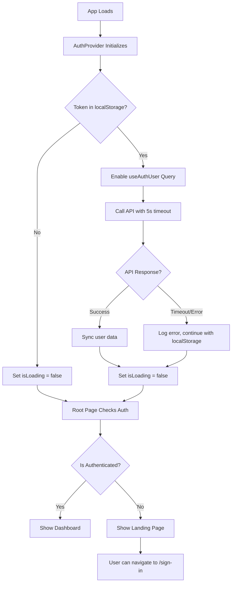

# Routing Hang Issue - Diagnosis and Fix

## Problem Statement

The application hangs on the loading spinner when trying to navigate to the sign-in page. The root cause is the AuthProvider attempting to call the backend API when no backend is running.

## Root Cause Analysis

### The Issue Flow

```
┌─────────────────────────────────────────────────────────────┐
│ 1. App Loads (root page /)                                  │
└────────────────────┬────────────────────────────────────────┘
                     │
                     ▼
┌─────────────────────────────────────────────────────────────┐
│ 2. AuthProvider Initializes                                 │
│    - Checks localStorage for token                          │
│    - If token exists: enables useAuthUser query             │
└────────────────────┬────────────────────────────────────────┘
                     │
                     ▼
┌─────────────────────────────────────────────────────────────┐
│ 3. useAuthUser Query Executes                               │
│    - Calls: GET /auth/me                                    │
│    - URL: http://localhost:3001/api/auth/me                │
└────────────────────┬────────────────────────────────────────┘
                     │
                     ▼
┌─────────────────────────────────────────────────────────────┐
│ 4. Backend Not Running                                      │
│    - Request hangs (network timeout)                         │
│    - Even with retry: false, initial fetch takes time        │
└────────────────────┬────────────────────────────────────────┘
                     │
                     ▼
┌─────────────────────────────────────────────────────────────┐
│ 5. App Stuck in Loading State                               │
│    - isLoading = true in AuthProvider                       │
│    - Root page shows LoadingSpinner                          │
│    - User cannot navigate to sign-in                        │
└─────────────────────────────────────────────────────────────┘
```

### Code Locations

#### 1. AuthProvider (src/components/auth/auth-provider.tsx:64-68)

```typescript
const { data: apiUser, refetch: refetchUser } = useAuthUser({
  queryKey: ["user"],
  enabled: authUtils.hasValidToken(), // ← Enables query if token exists
  retry: false,
})
```

**Problem:** When `authUtils.hasValidToken()` returns `true`, the query is enabled and immediately tries to fetch from the API.

#### 2. useAuthUser Hook (src/lib/api-client.ts:406-413)

```typescript
export function useAuthUser(options?: UseQueryOptions<AuthUser>) {
  return useQuery({
    queryKey: ["user"],
    queryFn: () => authApi.getMe(), // ← Calls API
    retry: false,
    ...options,
  })
}
```

**Problem:** The query function calls `authApi.getMe()` which makes a network request.

#### 3. authApi.getMe (src/lib/api-client.ts:360-363)

```typescript
getMe: () =>
  apiRequest<AuthUser>("/auth/me", {
    method: "GET",
  }),
```

**Problem:** Makes HTTP request to backend that may not be running.

#### 4. apiRequest Function (src/lib/api-client.ts:15-46)

```typescript
async function apiRequest<T>(endpoint: string, options: RequestInit = {}): Promise<T> {
  const url = `${API_BASE_URL}${endpoint}`  // ← http://localhost:3001/api
  const response = await fetch(url, { ... })  // ← Hangs if backend not running
  // ...
}
```

**Problem:** The `fetch` call has no timeout and will wait for the browser's default timeout (often 30+ seconds).

### Secondary Issue: Root Page Dynamic Import

#### 5. Root Page (src/app/page.tsx:73)

```typescript
const LandingPage = require("@/app/(marketing)/page").default
```

**Problem:** Using `require()` in a client component is not the recommended Next.js pattern. This can cause issues with client-side routing and hydration.

## Solution Strategy

### Immediate Fix (Priority 1)

Make the AuthProvider fail fast when the backend is not available, allowing the app to proceed even if the API call fails.

### Long-term Fix (Priority 2)

Implement static authentication mode to bypass API calls entirely when backend is not needed.

## Implementation Plan

### Phase 1: Fix the Immediate Routing Hang

#### 1.1 Add Error Handling to AuthProvider

**File:** `src/components/auth/auth-provider.tsx`

Add error handling for the useAuthUser query:

```typescript
const {
  data: apiUser,
  refetch: refetchUser,
  error: userError,
} = useAuthUser({
  queryKey: ["user"],
  enabled: authUtils.hasValidToken(),
  retry: false,
  // Add these options to fail fast
  staleTime: 5 * 60 * 1000, // 5 minutes
  gcTime: 10 * 60 * 1000, // 10 minutes
})

// Add effect to handle API errors gracefully
useEffect(() => {
  if (userError) {
    console.error("Failed to fetch user from API:", userError)
    // If API fails, we still have the user from localStorage
    // Just log the error and continue
    setIsLoading(false)
  }
}, [userError])
```

#### 1.2 Add Timeout to API Requests

**File:** `src/lib/api-client.ts`

Add a timeout to the fetch request:

```typescript
async function apiRequest<T>(
  endpoint: string,
  options: RequestInit = {}
): Promise<T> {
  const url = `${API_BASE_URL}${endpoint}`
  const token = getToken()

  // Create abort controller for timeout
  const controller = new AbortController()
  const timeoutId = setTimeout(() => controller.abort(), 5000) // 5 second timeout

  try {
    const response = await fetch(url, {
      ...options,
      signal: controller.signal,
      headers: {
        "Content-Type": "application/json",
        ...(token && { Authorization: `Bearer ${token}` }),
        ...options.headers,
      },
    })

    clearTimeout(timeoutId)

    // Handle 401 Unauthorized
    if (response.status === 401) {
      removeToken()
      if (typeof window !== "undefined") {
        window.location.href = "/sign-in"
      }
      throw new Error("Session expired. Please sign in again.")
    }

    if (!response.ok) {
      throw new Error(`API Error: ${response.statusText}`)
    }

    return response.json()
  } catch (error) {
    clearTimeout(timeoutId)
    // If aborted due to timeout
    if (error instanceof Error && error.name === "AbortError") {
      throw new Error("Request timeout. Backend may not be running.")
    }
    throw error
  }
}
```

#### 1.3 Fix Root Page Dynamic Import

**File:** `src/app/page.tsx`

Replace the `require()` with proper Next.js dynamic import or direct import:

```typescript
// Option 1: Direct import (if no circular dependency)

// OR Option 2: Dynamic import (if circular dependency)
import dynamic from "next/dynamic"

import LandingPage from "@/app/(marketing)/page"

const LandingPage = dynamic(
  () => import("@/app/(marketing)/page").then((mod) => mod.default),
  { ssr: false }
)
```

### Phase 2: Implement Static Auth Mode (Complete Solution)

This is covered in the main plan document `static-credential-auth-refactor.md`.

## Testing the Fix

### Before Fix:

1. Clear localStorage
2. Add a fake token to localStorage
3. Refresh page
4. **Result:** App hangs on loading spinner

### After Fix:

1. Clear localStorage
2. Add a fake token to localStorage
3. Refresh page
4. **Result:** App loads landing page, user can navigate to sign-in

### Test Cases:

- [ ] No token in localStorage → Shows landing page immediately
- [ ] Invalid token in localStorage → Clears token, shows landing page
- [ ] Valid token but backend down → Uses localStorage user, shows dashboard
- [ ] Valid token and backend up → Syncs with API, shows dashboard
- [ ] Navigate to /sign-in from landing → Works immediately
- [ ] Navigate to /dashboard without auth → Redirects to /sign-in

## Mermaid Diagram: Fixed Flow



## Security Considerations

- The timeout should be long enough for legitimate requests (5 seconds is reasonable)
- Error messages should not expose sensitive information
- localStorage should be cleared on 401 responses
- Static credentials should NEVER be used in production

## Related Files

| File                                    | Change Type | Description                        |
| --------------------------------------- | ----------- | ---------------------------------- |
| `src/components/auth/auth-provider.tsx` | Update      | Add error handling for useAuthUser |
| `src/lib/api-client.ts`                 | Update      | Add timeout to fetch requests      |
| `src/app/page.tsx`                      | Update      | Fix dynamic import pattern         |
| `src/lib/static-auth-utils.ts`          | New         | Static credential validation       |
| `.env.example`                          | Update      | Add NEXT_PUBLIC_STATIC_AUTH_MODE   |

## Next Steps

1. Implement Phase 1 fixes to resolve the immediate routing hang
2. Test that navigation to sign-in page works
3. Implement Phase 2 (static auth mode) for complete solution
4. Full end-to-end testing
