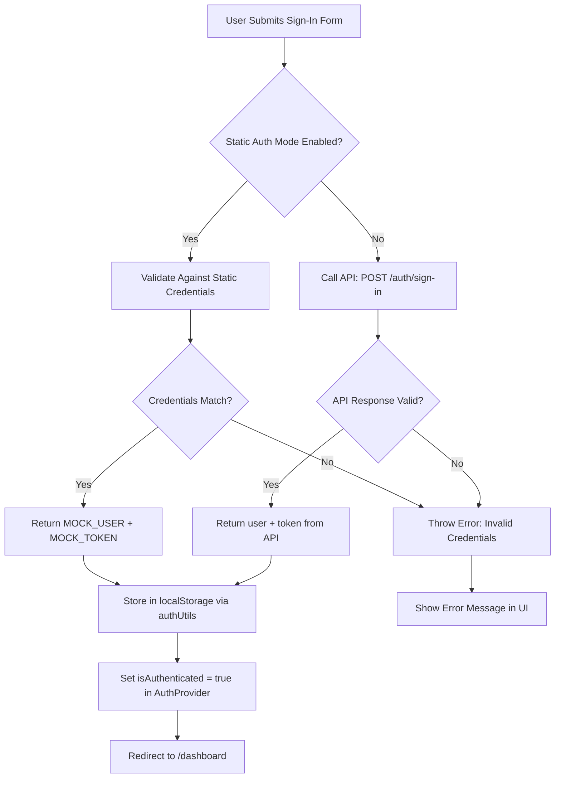

# Static Authentication Implementation Plan

## Overview

Implement a static authentication mechanism using predefined email and password credentials for development and testing without requiring a running backend server. The implementation focuses on backend logic only - no form modifications required.

## Static Credentials Reference

```
Email: dev@taskflow.local
Password: dev123456
```

## Implementation Architecture



## Implementation Steps

### Step 1: Create Static Auth Utilities

**File:** `src/lib/static-auth-utils.ts` (NEW)

Create utility functions for static credential validation:

```typescript
import type { AuthUser } from "./api-client"
import {
  isStaticAuthMode,
  MOCK_TOKEN,
  MOCK_USER,
  STATIC_CREDENTIALS,
} from "./static-credentials"

/**
 * Validate credentials against static values
 * @param email - User's email
 * @param password - User's password
 * @returns true if credentials match, false otherwise
 */
export function validateStaticCredentials(
  email: string,
  password: string
): boolean {
  return (
    email === STATIC_CREDENTIALS.email &&
    password === STATIC_CREDENTIALS.password
  )
}

/**
 * Get static auth response (simulates API response)
 * @returns AuthResponse with mock user and token
 */
export function getStaticAuthResponse() {
  return {
    user: MOCK_USER,
    token: MOCK_TOKEN,
  }
}

/**
 * Check if static auth is enabled and validate credentials
 * @param email - User's email
 * @param password - User's password
 * @returns AuthResponse if valid, null otherwise
 */
export function authenticateStatic(
  email: string,
  password: string
): { user: AuthUser; token: string } | null {
  if (!isStaticAuthMode()) {
    return null
  }

  if (validateStaticCredentials(email, password)) {
    return getStaticAuthResponse()
  }

  return null
}
```

### Step 2: Update AuthProvider

**File:** `src/components/auth/auth-provider.tsx`

Modify the `signIn` function to support static authentication mode:

```typescript
import { authenticateStatic, isStaticAuthMode } from "@/lib/static-auth-utils"

// In the signIn function:
const signIn = useCallback(
  async (email: string, password: string) => {
    setError(null)
    setIsLoading(true)

    try {
      let result: { user: AuthUser; token: string }

      // Check if static auth mode is enabled
      if (isStaticAuthMode()) {
        const staticResult = authenticateStatic(email, password)
        if (!staticResult) {
          throw new Error("Invalid email or password")
        }
        result = staticResult
      } else {
        // Use API-based authentication
        result = await signInMutation.mutateAsync({ email, password })
      }

      // Store token and user data
      authUtils.setAuthData(result.token, result.user)

      // Update local state
      setUser(result.user)

      setIsLoading(false)
    } catch (err) {
      const message = err instanceof Error ? err.message : "Failed to sign in"
      setError(message)
      setIsLoading(false)
      throw err
    }
  },
  [signInMutation]
)
```

### Step 3: Create Environment Configuration

**File:** `.env.local` (NEW)

Create a local environment file with the static auth mode flag:

```env
NEXT_PUBLIC_STATIC_AUTH_MODE=true
```

## Testing Checklist

### Authentication Flow

- [ ] Navigate to `/sign-in` from landing page
- [ ] Enter incorrect static credentials → Show error message "Invalid email or password"
- [ ] Enter correct static credentials → Redirect to `/dashboard`
- [ ] Refresh page → Stay authenticated (token in localStorage)
- [ ] Sign out → Redirect to landing page

### Protected Routes

- [ ] Try to access `/dashboard` while not authenticated → Redirect to `/sign-in`
- [ ] Try to access `/board/[boardId]` while not authenticated → Redirect to `/sign-in`
- [ ] Access protected routes after authentication → Content displayed

### Workspace and Boards Access

- [ ] After authentication, verify user can view homepage
- [ ] Verify workspaces are displayed
- [ ] Verify boards are displayed
- [ ] Verify user can navigate between workspaces and boards

### Static Auth Mode Toggle

- [ ] Set `NEXT_PUBLIC_STATIC_AUTH_MODE=false` → Use API authentication
- [ ] Set `NEXT_PUBLIC_STATIC_AUTH_MODE=true` → Use static authentication

## Security Notes

⚠️ **WARNING**: Static credentials are for development/testing only!

- Never use static credentials in production
- Never commit real credentials to version control
- Always use environment variables for sensitive data
- The static auth mode should be disabled in production builds

## File Changes Summary

| File                                    | Change Type | Description                            |
| --------------------------------------- | ----------- | -------------------------------------- |
| `.env.local`                            | New         | Add NEXT_PUBLIC_STATIC_AUTH_MODE flag  |
| `src/lib/static-auth-utils.ts`          | New         | Static credential validation utilities |
| `src/components/auth/auth-provider.tsx` | Update      | Support static auth mode in signIn     |

## Verification Steps

1. **Enable Static Auth Mode**: Set `NEXT_PUBLIC_STATIC_AUTH_MODE=true` in `.env.local`
2. **Start Development Server**: Run `npm run dev`
3. **Navigate to Sign-In**: Go to `http://localhost:3000/sign-in`
4. **Test Invalid Credentials**: Enter wrong credentials and verify error message
5. **Test Valid Credentials**: Enter correct credentials and verify successful login
6. **Verify Session Persistence**: Refresh the page and confirm user stays logged in
7. **Test Sign-Out**: Sign out and verify redirect to landing page
8. **Test Protected Routes**: Try accessing `/dashboard` while logged out (should redirect)
9. **Verify Workspace Access**: After login, confirm user can view workspaces and boards
