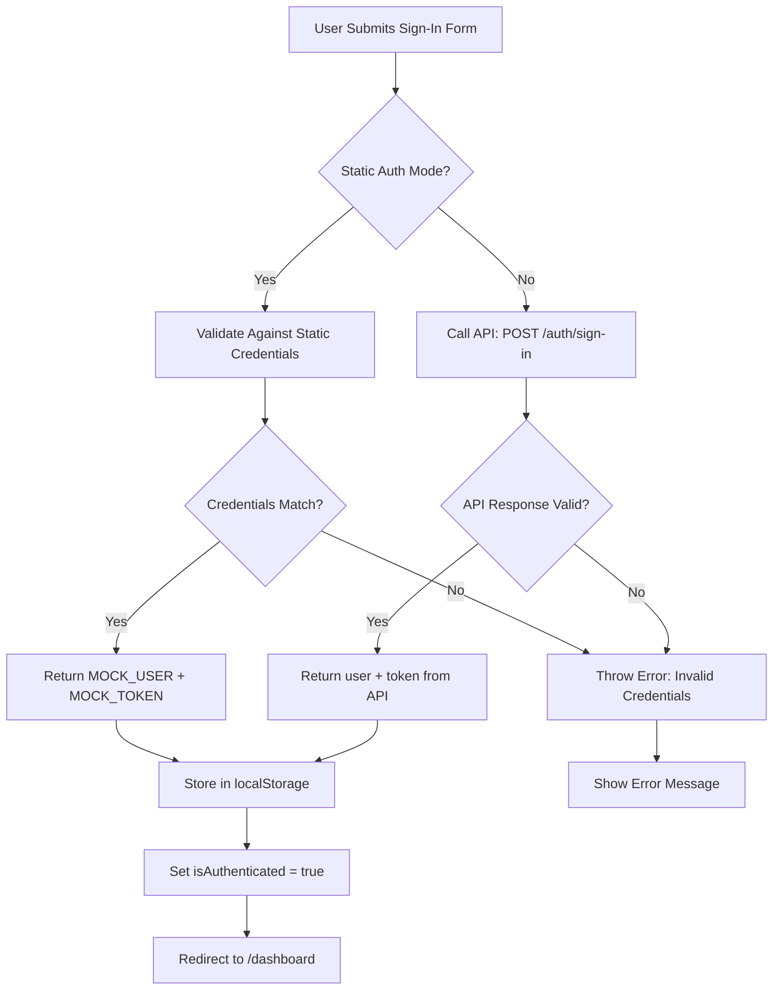
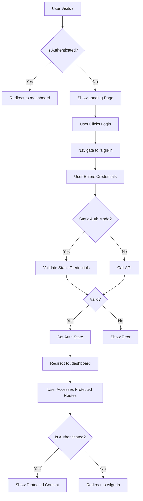

# Static Credential Authentication Refactor Plan

## Overview

Refactor the authentication system to use static hardcoded credentials instead of dynamic backend API calls. This will enable development and testing without requiring a running backend server.

## Current State Analysis

### Existing Authentication Flow

```
┌─────────────────┐
│  User Signs In  │
└────────┬────────┘
         │
         ▼
┌─────────────────────────────────┐
│  Sign-In Page (useSignIn hook)  │
│  - Calls API: POST /auth/sign-in│
│  - Returns: { user, token }      │
└────────┬────────────────────────┘
         │
         ▼
┌─────────────────────────────────┐
│  AuthProvider                   │
│  - Stores token in localStorage │
│  - Stores user in localStorage  │
│  - Sets isAuthenticated = true   │
└────────┬────────────────────────┘
         │
         ▼
┌─────────────────────────────────┐
│  Protected Routes               │
│  - Checks isAuthenticated       │
│  - Redirects to /sign-in if not │
└─────────────────────────────────┘
```

### Static Credentials (Already Defined)

File: `src/lib/static-credentials.ts`

```typescript
export const STATIC_CREDENTIALS = {
  email: "dev@taskflow.local",
  password: "dev123456",
}

export const MOCK_USER: AuthUser = {
  id: "dev-user-001",
  name: "Developer User",
  email: "dev@taskflow.local",
  createdAt: new Date().toISOString(),
  updatedAt: new Date().toISOString(),
}

export const MOCK_TOKEN = "dev-static-auth-token"
```

### Routing Structure

```
/ (root)
├── Landing Page (if not authenticated)
├── Redirects to /dashboard (if authenticated)
│
├── /sign-in (marketing route group)
│   └── Sign-In Form
│
├── /sign-up (marketing route group)
│   └── Sign-Up Form
│
└── /dashboard (platform route group - protected)
    └── Boards View
```

## Implementation Plan

### Phase 1: Environment Configuration

**File: `.env.example`**

Add the static auth mode flag:

```env
# Static Authentication Mode (for development/testing without backend)
NEXT_PUBLIC_STATIC_AUTH_MODE=true
```

### Phase 2: Static Auth Utilities

**File: `src/lib/static-auth-utils.ts`** (New)

Create utilities for static credential validation:

```typescript
import type { AuthUser } from "./api-client"
import {
  isStaticAuthMode,
  MOCK_TOKEN,
  MOCK_USER,
  STATIC_CREDENTIALS,
} from "./static-credentials"

/**
 * Validate credentials against static values
 * @param email - User's email
 * @param password - User's password
 * @returns true if credentials match, false otherwise
 */
export function validateStaticCredentials(
  email: string,
  password: string
): boolean {
  return (
    email === STATIC_CREDENTIALS.email &&
    password === STATIC_CREDENTIALS.password
  )
}

/**
 * Get static auth response (simulates API response)
 * @returns AuthResponse with mock user and token
 */
export function getStaticAuthResponse() {
  return {
    user: MOCK_USER,
    token: MOCK_TOKEN,
  }
}

/**
 * Check if static auth is enabled and validate credentials
 * @param email - User's email
 * @param password - User's password
 * @returns AuthResponse if valid, null otherwise
 */
export function authenticateStatic(
  email: string,
  password: string
): { user: AuthUser; token: string } | null {
  if (!isStaticAuthMode()) {
    return null
  }

  if (validateStaticCredentials(email, password)) {
    return getStaticAuthResponse()
  }

  return null
}
```

### Phase 3: Refactor AuthProvider

**File: `src/components/auth/auth-provider.tsx`**

Update to support static authentication mode:

```typescript
import { authenticateStatic, isStaticAuthMode } from "@/lib/static-auth-utils"

// In the signIn function:
const signIn = useCallback(
  async (email: string, password: string) => {
    setError(null)
    setIsLoading(true)

    try {
      let result: { user: AuthUser; token: string }

      // Check if static auth mode is enabled
      if (isStaticAuthMode()) {
        const staticResult = authenticateStatic(email, password)
        if (!staticResult) {
          throw new Error("Invalid email or password")
        }
        result = staticResult
      } else {
        // Use API-based authentication
        result = await signInMutation.mutateAsync({ email, password })
      }

      // Store token and user data
      authUtils.setAuthData(result.token, result.user)

      // Update local state
      setUser(result.user)

      setIsLoading(false)
    } catch (err) {
      const message = err instanceof Error ? err.message : "Failed to sign in"
      setError(message)
      setIsLoading(false)
      throw err
    }
  },
  [signInMutation]
)
```

### Phase 4: Update Sign-In Page

**File: `src/app/(marketing)/sign-in/page.tsx`**

The sign-in page already uses the `useSignIn` hook from api-client, which calls the AuthProvider's signIn method. The main change needed is to ensure the sign-in page works correctly with static auth mode.

Key changes:

1. Keep the existing form structure
2. The form already calls `signInMutation.mutateAsync(data)` which will now use static auth if enabled
3. Ensure proper error messages are displayed
4. Add a note about static credentials when in static auth mode

```tsx
// Add import for static auth mode check
import { isStaticAuthMode } from "@/lib/static-credentials"

// In the component, add a hint when in static auth mode:
{
  isStaticAuthMode() && (
    <div className="mb-4 rounded-lg bg-blue-50 p-3 text-sm text-blue-800 dark:bg-blue-900/20 dark:text-blue-200">
      <p className="font-medium">Development Mode</p>
      <p className="text-xs">
        Email: {STATIC_CREDENTIALS.email}
        <br />
        Password: {STATIC_CREDENTIALS.password}
      </p>
    </div>
  )
}
```

### Phase 5: Update Sign-Up Page

**File: `src/app/(marketing)/sign-up/page.tsx`**

When in static auth mode, sign-up should be disabled since we only have one static user:

```tsx
import { isStaticAuthMode } from "@/lib/static-credentials"

// At the top of the component:
if (isStaticAuthMode()) {
  return (
    <main className="flex min-h-screen items-center justify-center">
      <div className="max-w-md space-y-4 p-8 text-center">
        <h1 className="text-2xl font-semibold">Sign Up Unavailable</h1>
        <p className="text-muted-foreground">
          Sign up is not available in static authentication mode. Please use the
          sign-in page with the static credentials.
        </p>
        <Button asChild>
          <Link href="/sign-in">Go to Sign In</Link>
        </Button>
      </div>
    </main>
  )
}
```

### Phase 6: API Client Hooks (Optional Enhancement)

**File: `src/lib/api-client.ts`**

The API client hooks don't need major changes since the AuthProvider handles the static auth logic. However, we can add a helper to check if we should skip API calls:

```typescript
// Add utility function
export function shouldUseStaticAuth(): boolean {
  return (
    typeof window !== "undefined" &&
    process.env.NEXT_PUBLIC_STATIC_AUTH_MODE === "true"
  )
}
```

### Phase 7: Routing Verification

The routing structure is already set up correctly:

1. **Landing Page** (`/`) - Shows login button linking to `/sign-in`
2. **Sign-In Page** (`/sign-in`) - Accessible from marketing route group
3. **Protected Routes** (`/dashboard`, `/board/[boardId]`, etc.) - Wrapped with ProtectedRoute component
4. **Root Page** (`src/app/page.tsx`) - Handles conditional routing based on auth state

### Phase 8: Error Handling

Ensure proper error messages are displayed:

- **Invalid credentials**: "Invalid email or password"
- **Network error**: "Failed to sign in. Please check your connection."
- **Static auth specific**: Show helpful hints about static credentials

## Testing Checklist

### Authentication Flow

- [ ] Navigate to `/sign-in` from landing page
- [ ] Enter incorrect static credentials → Show error message
- [ ] Enter correct static credentials → Redirect to `/dashboard`
- [ ] Refresh page → Stay authenticated (token in localStorage)
- [ ] Sign out → Redirect to landing page

### Protected Routes

- [ ] Try to access `/dashboard` while not authenticated → Redirect to `/sign-in`
- [ ] Try to access `/board/[boardId]` while not authenticated → Redirect to `/sign-in`
- [ ] Access protected routes after authentication → Content displayed

### Sign-Up Page

- [ ] Navigate to `/sign-up` in static auth mode → Show disabled message
- [ ] Click "Go to Sign In" → Navigate to sign-in page

### Static Auth Mode Toggle

- [ ] Set `NEXT_PUBLIC_STATIC_AUTH_MODE=false` → Use API authentication
- [ ] Set `NEXT_PUBLIC_STATIC_AUTH_MODE=true` → Use static authentication

## Static Credentials Reference

For development/testing:

```
Email: dev@taskflow.local
Password: dev123456
```

## Security Notes

⚠️ **WARNING**: Static credentials are for development/testing only!

- Never use static credentials in production
- Never commit real credentials to version control
- Always use environment variables for sensitive data
- The static auth mode should be disabled in production builds

## File Changes Summary

| File                                    | Change Type | Description                            |
| --------------------------------------- | ----------- | -------------------------------------- |
| `.env.example`                          | Update      | Add NEXT_PUBLIC_STATIC_AUTH_MODE flag  |
| `src/lib/static-auth-utils.ts`          | New         | Static credential validation utilities |
| `src/components/auth/auth-provider.tsx` | Update      | Support static auth mode in signIn     |
| `src/app/(marketing)/sign-in/page.tsx`  | Update      | Add static auth hints                  |
| `src/app/(marketing)/sign-up/page.tsx`  | Update      | Disable in static auth mode            |
| `src/lib/api-client.ts`                 | Optional    | Add shouldUseStaticAuth helper         |

## Mermaid Diagram: Static Auth Flow



## Mermaid Diagram: Routing Flow



## Next Steps

Once this plan is approved, switch to Code mode to implement the changes:

1. Update `.env.example`
2. Create `src/lib/static-auth-utils.ts`
3. Refactor `src/components/auth/auth-provider.tsx`
4. Update sign-in page
5. Update sign-up page
6. Test the complete flow
