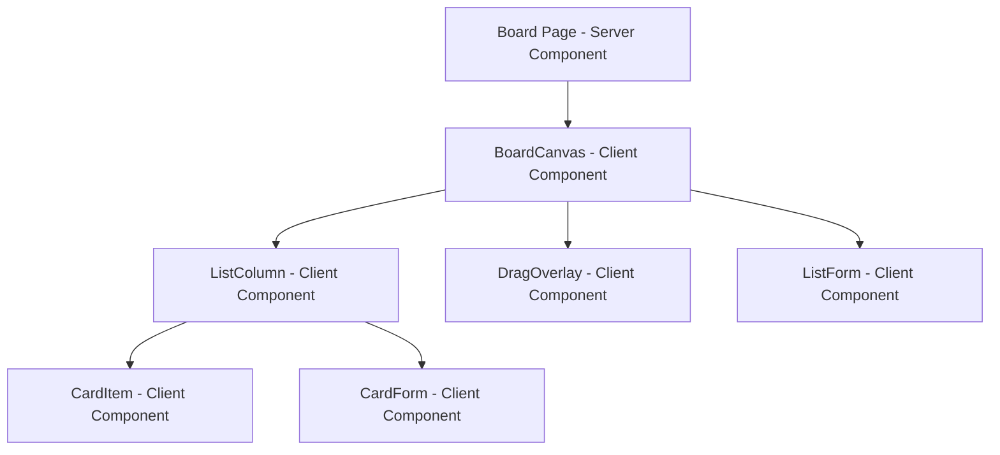

# Workspace Revamp - AGENTS.md Compliance Plan

## Executive Summary

This plan outlines the comprehensive revamp of the workspace/organization functionality to comply with the AGENTS.md architectural directives. The revamp focuses on implementing `@dnd-kit` for drag and drop, fractional indexing for ordering, normalized cache architecture, and 60FPS performance optimization.

## Current State Analysis

### Existing Implementation

- **Drag & Drop Library**: `@hello-pangea/dnd` (non-compliant with AGENTS.md)
- **Ordering System**: Integer-based (`position: number`)
- **State Management**: React Query with nested data structures
- **Cache Strategy**: Simple invalidation without direct cache mutation
- **Performance**: Not optimized for 60FPS during drag operations
- **Real-time**: Not designed for real-time updates
- **Architecture**: Monolithic client components without clear separation

### Key Issues

1. ❌ Wrong drag & drop library (must use `@dnd-kit`)
2. ❌ Integer ordering causes massive reorder operations
3. ❌ No normalized cache layer for O(1) updates
4. ❌ No fractional indexing strategy
5. ❌ No optimistic update with rollback
6. ❌ Not real-time ready
7. ❌ No AI-ready metadata structure
8. ❌ No activity timeline on cards
9. ❌ No permission-ready design

## Architectural Vision

### Core Principles

- **60FPS Non-Negotiable**: All drag operations must maintain 60FPS
- **O(1) Updates**: Entity-based normalized cache
- **Fractional Indexing**: Gap strategy for infinite reordering
- **Real-Time Ready**: Event-driven cache updates
- **Permission-Ready**: Guards for all operations
- **AI-Ready**: Metadata structure for future features
- **Minimal Client JS**: Server-first architecture where possible

## System Architecture

```mermaid
graph TB
    subgraph "Server Components"
        AppShell[App Shell]
        Sidebar[Sidebar]
        Navbar[Navbar]
        BoardHeader[Static Board Header]
    end

    subgraph "Client Components (Minimal Surface)"
        BoardCanvas[BoardCanvas]
        ListColumn[ListColumn]
        CardItem[CardItem]
        DragOverlay[DragOverlay]
    end

    subgraph "State Management"
        NormalizedCache[Normalized Cache Layer]
        Entities[Entities: boards, lists, cards]
        Relations[Relations: boardLists, listCards]
    end

    subgraph "Drag & Drop"
        DndKitCore[@dnd-kit/core]
        DndKitSortable[@dnd-kit/sortable]
        DndKitModifiers[@dnd-kit/modifiers]
    end

    AppShell --> BoardCanvas
    Sidebar --> BoardCanvas
    Navbar --> BoardCanvas
    BoardHeader --> BoardCanvas

    BoardCanvas --> ListColumn
    ListColumn --> CardItem
    CardItem --> DragOverlay

    BoardCanvas --> NormalizedCache
    NormalizedCache --> Entities
    NormalizedCache --> Relations

    BoardCanvas --> DndKitCore
    ListColumn --> DndKitSortable
    CardItem --> DndKitModifiers
```

## Data Architecture

### Normalized Cache Structure

```typescript
// src/store/normalized-cache.ts
interface NormalizedCache {
  entities: {
    boards: Record<string, BoardMeta>
    lists: Record<string, ListMeta>
    cards: Record<string, Card>
    users: Record<string, User>
  }
  relations: {
    boardLists: Record<boardId, string[]>
    listCards: Record<listId, string[]>
    cardAssignees: Record<cardId, string[]>
  }
  metadata: {
    lastSync: number
    pendingUpdates: Set<string>
  }
}

interface BoardMeta {
  id: string
  title: string
  imageId: string | null
  orgId: string
  createdAt: Date
  updatedAt: Date
}

interface ListMeta {
  id: string
  title: string
  boardId: string
  order: string // Fractional index
  createdAt: Date
  updatedAt: Date
}

interface Card {
  id: string
  title: string
  description: string | null
  listId: string
  order: string // Fractional index
  priority: "low" | "medium" | "high" | "urgent"
  labels: CardLabel[]
  assignees: string[] // User IDs
  dueDate: Date | null
  createdAt: Date
  updatedAt: Date

  // AI-ready metadata
  aiMetadata?: {
    summary?: string
    embeddingId?: string
    autoTags?: string[]
  }

  // Activity timeline
  activity: CardActivity[]
}

interface CardActivity {
  id: string
  type: "move" | "edit" | "comment" | "assign" | "create" | "delete"
  userId: string
  timestamp: Date
  metadata?: Record<string, unknown>
}

interface CardLabel {
  id: string
  name: string
  color: string
  description?: string
}
```

### Fractional Indexing Strategy

```typescript
// src/lib/fractional-indexing.ts
/**
 * Lexicographic fractional indexing for infinite reordering
 * Based on Figma's approach
 */
export class FractionalIndex {
  private static BASE = "abcdefghijklmnopqrstuvwxyz012345"
  private static MIN = "a0"
  private static MAX = "zz"

  /**
   * Generate a new order between two existing orders
   */
  static generateBetween(prev: string | null, next: string | null): string {
    if (prev === null && next === null) {
      return this.MIDDLE
    }

    if (prev === null) {
      return this.generateLessThan(next!)
    }

    if (next === null) {
      return this.generateGreaterThan(prev)
    }

    return this.generateBetweenOrders(prev, next)
  }

  /**
   * Compare two fractional indices
   */
  static compare(a: string, b: string): number {
    return a.localeCompare(b)
  }

  private static MIDDLE = "a0"

  private static generateLessThan(order: string): string {
    // Implementation for generating index less than given order
    // ...
  }

  private static generateGreaterThan(order: string): string {
    // Implementation for generating index greater than given order
    // ...
  }

  private static generateBetweenOrders(prev: string, next: string): string {
    // Implementation for generating index between two orders
    // ...
  }
}
```

## Component Architecture

### Component Hierarchy



### Component Responsibilities

#### BoardCanvas (Client Component)

- Manages drag & drop context using `@dnd-kit/core`
- Handles drag events and optimistic updates
- Coordinates with normalized cache
- Minimal state, delegates to cache

#### ListColumn (Client Component)

- Renders list of cards using `@dnd-kit/sortable`
- Implements vertical virtualization for 500+ cards
- Handles list-level drag operations
- Uses `closestCorners` collision detection

#### CardItem (Client Component)

- Minimal rendering of card data
- Optimized for 60FPS during drag
- Uses CSS transforms only during drag
- No expensive calculations during drag

#### DragOverlay (Client Component)

- Lightweight representation of dragged item
- No nested components
- No expensive styles or shadows
- Zero dropped frames goal

## Drag & Drop Implementation

### Configuration

```typescript
// src/components/boards/dnd-config.ts
import {
  closestCorners,
  DndContext,
  DragEndEvent,
  DragOverEvent,
  DragOverlay,
  DragStartEvent,
  PointerSensor,
  rectIntersection,
  useSensor,
  useSensors,
} from "@dnd-kit/core"
import { restrictToWindowEdges } from "@dnd-kit/modifiers"
import {
  horizontalListSortingStrategy,
  SortableContext,
  verticalListSortingStrategy,
} from "@dnd-kit/sortable"

export const dndConfig = {
  // Sensors
  sensors: {
    pointer: {
      activationConstraint: {
        distance: 5, // Only trigger drag after 5px movement
      },
    },
  },

  // Collision detection
  collisionDetection: {
    cards: closestCorners,
    lists: rectIntersection,
  },

  // Modifiers
  modifiers: [restrictToWindowEdges],

  // Sorting strategies
  sorting: {
    cards: verticalListSortingStrategy,
    lists: horizontalListSortingStrategy,
  },
}
```

### Optimistic Update Strategy

```typescript
// src/hooks/use-optimistic-update.ts
import { useCallback } from "react"
import { NormalizedCache } from "@/store/normalized-cache"
import { useMutation } from "@tanstack/react-query"

import { FractionalIndex } from "@/lib/fractional-indexing"

export function useOptimisticUpdate() {
  const cache = useNormalizedCache()

  const updateCardPosition = useMutation({
    mutationFn: async (params: UpdateCardPositionParams) => {
      return api.updateCardPosition(params)
    },

    onMutate: async (params) => {
      // 1. Cancel outgoing refetches
      await queryClient.cancelQueries(["board", params.boardId])

      // 2. Snapshot previous state
      const previousState = cache.snapshot()

      // 3. Optimistically update cache
      cache.updateCardPosition({
        cardId: params.cardId,
        fromListId: params.fromListId,
        toListId: params.toListId,
        fromIndex: params.fromIndex,
        toIndex: params.toIndex,
        newOrder: FractionalIndex.generateBetween(
          params.prevOrder,
          params.nextOrder
        ),
      })

      // 4. Return context for rollback
      return { previousState }
    },

    onError: (error, variables, context) => {
      // 5. Rollback on error
      if (context?.previousState) {
        cache.restore(context.previousState)
      }

      // 6. Show non-blocking toast
      toast.error("Failed to move card", {
        description: error.message,
      })
    },

    onSettled: () => {
      // 7. Always refetch after error or success
      queryClient.invalidateQueries(["board", params.boardId])
    },
  })

  return { updateCardPosition }
}
```

## Real-Time Ready Architecture

### Event-Driven Cache Updates

```typescript
// src/hooks/use-real-time-updates.ts
import { useEffect } from "react"
import { NormalizedCache } from "@/store/normalized-cache"

type RealTimeEvent =
  | { type: "CARD_UPDATED"; cardId: string; data: Partial<Card> }
  | {
      type: "CARD_MOVED"
      cardId: string
      fromListId: string
      toListId: string
      newOrder: string
    }
  | { type: "CARD_DELETED"; cardId: string }
  | { type: "LIST_RENAMED"; listId: string; title: string }
  | { type: "LIST_DELETED"; listId: string }

export function useRealTimeUpdates(boardId: string) {
  const cache = useNormalizedCache()

  useEffect(() => {
    // WebSocket connection (when implemented)
    const ws = new WebSocket(`ws://localhost:3001/boards/${boardId}`)

    ws.onmessage = (event) => {
      const message: RealTimeEvent = JSON.parse(event.data)

      switch (message.type) {
        case "CARD_UPDATED":
          cache.patchCard(message.cardId, message.data)
          break
        case "CARD_MOVED":
          cache.moveCard(
            message.cardId,
            message.fromListId,
            message.toListId,
            message.newOrder
          )
          break
        case "CARD_DELETED":
          cache.removeCard(message.cardId)
          break
        case "LIST_RENAMED":
          cache.patchList(message.listId, { title: message.title })
          break
        case "LIST_DELETED":
          cache.removeList(message.listId)
          break
      }
    }

    return () => ws.close()
  }, [boardId, cache])
}
```

## Implementation Plan

### Phase 1: Foundation (Dependencies & Core Infrastructure)

1. **Install @dnd-kit packages**
   - `@dnd-kit/core`
   - `@dnd-kit/sortable`
   - `@dnd-kit/modifiers`
   - Remove `@hello-pangea/dnd`

2. **Create normalized cache layer**
   - `src/store/normalized-cache.ts`
   - `src/store/cache-slice.ts`
   - `src/store/relations-slice.ts`

3. **Implement fractional indexing**
   - `src/lib/fractional-indexing.ts`
   - Unit tests for edge cases

4. **Create type definitions**
   - Update `src/lib/api-client.ts` with new types
   - Add AI metadata types
   - Add activity timeline types

### Phase 2: Data Layer (Cache & API Integration)

5. **Create cache hooks**
   - `src/hooks/use-normalized-cache.ts`
   - `src/hooks/use-board-data.ts`
   - `src/hooks/use-list-data.ts`
   - `src/hooks/use-card-data.ts`

6. **Implement optimistic update hooks**
   - `src/hooks/use-optimistic-update.ts`
   - `src/hooks/use-card-move.ts`
   - `src/hooks/use-list-move.ts`

7. **Create real-time ready hooks**
   - `src/hooks/use-real-time-updates.ts`
   - Event handlers for WebSocket events

### Phase 3: Drag & Drop Layer

8. **Create DnD configuration**
   - `src/components/boards/dnd-config.ts`
   - Sensor configuration
   - Collision detection setup

9. **Implement BoardCanvas component**
   - `src/components/boards/board-canvas.tsx`
   - Drag context setup
   - Event handlers

10. **Implement DragOverlay component**
    - `src/components/boards/drag-overlay.tsx`
    - Minimal rendering
    - Performance optimization

### Phase 4: Component Refactoring

11. **Refactor ListColumn component**
    - Convert to use `@dnd-kit/sortable`
    - Implement vertical virtualization
    - Use normalized cache

12. **Refactor CardItem component**
    - Convert to use `@dnd-kit/core`
    - Optimize for 60FPS
    - Remove expensive operations during drag

13. **Update ListForm component**
    - Integrate with normalized cache
    - Optimistic updates

14. **Update CardForm component**
    - Integrate with normalized cache
    - Optimistic updates

### Phase 5: Advanced Features

15. **Implement priority system**
    - Visual indicators
    - Filtering support
    - Bulk edit capability

16. **Implement smart labels**
    - Color support
    - Description support
    - Search indexing

17. **Add AI-ready metadata structure**
    - Extend Card type
    - Create metadata components
    - Prepare for future AI features

18. **Implement activity timeline**
    - Track all card activities
    - Display in card modal
    - Audit trail support

### Phase 6: Performance Optimization

19. **Implement virtualization**
    - Windowing for large lists
    - Maintain drag compatibility
    - Render only visible cards

20. **Optimize drag performance**
    - CSS transforms only
    - Disable pointer-events on siblings
    - Use will-change: transform
    - No state writes during drag

21. **Optimize re-renders**
    - Memoization strategies
    - Component isolation
    - Minimal prop drilling

### Phase 7: Permission & Security

22. **Implement permission guards**
    - Board-level permissions
    - List-level restrictions
    - Card-level visibility

23. **Add permission checks**
    - Before mutations
    - In UI components
    - In API calls

### Phase 8: Testing & Validation

24. **Unit tests**
    - Fractional indexing
    - Cache operations
    - Optimistic updates

25. **Integration tests**
    - Drag & drop flows
    - Real-time updates
    - Permission checks

26. **Performance tests**
    - 60FPS validation
    - Large list handling
    - Concurrent operations

## File Structure

```
src/
├── components/
│   └── boards/
│       ├── board-canvas.tsx          # NEW - Main drag context
│       ├── list-column.tsx           # REVAMP - Use @dnd-kit
│       ├── card-item.tsx             # REVAMP - Use @dnd-kit
│       ├── drag-overlay.tsx          # NEW - Minimal overlay
│       ├── dnd-config.ts             # NEW - DnD configuration
│       └── virtualized-list.tsx      # NEW - Virtualization wrapper
├── store/
│   ├── normalized-cache.ts           # NEW - Cache layer
│   ├── cache-slice.ts                # NEW - Cache operations
│   ├── relations-slice.ts            # NEW - Relations management
│   └── index.ts                      # NEW - Store entry point
├── lib/
│   ├── fractional-indexing.ts        # NEW - Fractional indexing
│   ├── cache-operations.ts           # NEW - Cache utilities
│   └── real-time-events.ts           # NEW - Event types
├── hooks/
│   ├── use-normalized-cache.ts       # NEW - Cache hook
│   ├── use-optimistic-update.ts      # NEW - Optimistic updates
│   ├── use-real-time-updates.ts      # NEW - Real-time hooks
│   ├── use-board-data.ts             # NEW - Board data hook
│   ├── use-list-data.ts              # NEW - List data hook
│   └── use-card-data.ts              # NEW - Card data hook
├── types/
│   ├── cache.ts                       # NEW - Cache types
│   ├── real-time.ts                   # NEW - Real-time types
│   └── entities.ts                    # NEW - Entity types
└── actions/
    ├── update-card-position/          # REVAMP - Fractional indexing
    ├── update-list-position/          # REVAMP - Fractional indexing
    └── ...                            # Other actions
```

## Migration Strategy

### Step 1: Parallel Implementation (Non-Breaking)

- Keep existing `@hello-pangea/dnd` implementation
- Implement new `@dnd-kit` components alongside
- Use feature flag to switch between implementations

### Step 2: Data Migration

- Migrate integer positions to fractional indices
- Batch update existing data
- Validate migration integrity

### Step 3: Gradual Rollout

- Enable for test boards first
- Monitor performance metrics
- Collect user feedback

### Step 4: Full Migration

- Remove old implementation
- Clean up unused code
- Update documentation

## Performance Benchmarks

### Target Metrics

- **Drag Operations**: 60FPS minimum
- **Large Lists (500+ cards)**: <100ms render time
- **Cache Updates**: <10ms for O(1) operations
- **Optimistic Updates**: <50ms UI feedback
- **Real-time Events**: <20ms propagation

### Measurement Strategy

- Use React DevTools Profiler
- Custom performance markers
- FPS counter during drag
- Bundle size monitoring

## Risk Mitigation

### Technical Risks

1. **Fractional Indexing Complexity**
   - Mitigation: Comprehensive unit tests
   - Fallback: Integer ordering for edge cases

2. **Cache Synchronization**
   - Mitigation: Event-driven architecture
   - Fallback: Periodic refetch

3. **Performance Regression**
   - Mitigation: Performance benchmarks
   - Fallback: Feature flags for rollback

### Operational Risks

1. **Data Migration Issues**
   - Mitigation: Backup before migration
   - Fallback: Rollback script

2. **User Adoption**
   - Mitigation: Gradual rollout
   - Fallback: Keep old UI available

## Success Criteria

### Functional Requirements

- ✅ Drag & drop works with `@dnd-kit`
- ✅ Fractional indexing for infinite reordering
- ✅ Optimistic updates with rollback
- ✅ Normalized cache for O(1) updates
- ✅ Real-time ready architecture
- ✅ AI-ready metadata structure
- ✅ Activity timeline on cards
- ✅ Permission-ready design

### Performance Requirements

- ✅ 60FPS during all drag operations
- ✅ <100ms render time for 500+ cards
- ✅ <10ms cache update time
- ✅ <50ms optimistic update feedback
- ✅ <20ms real-time event propagation

### Quality Requirements

- ✅ Zero dropped frames during drag
- ✅ No layout thrashing
- ✅ Minimal re-renders
- ✅ Clean separation of concerns
- ✅ Comprehensive test coverage

## Next Steps

1. **Review this plan** with the team
2. **Approve implementation approach**
3. **Set up development environment**
4. **Begin Phase 1 implementation**
5. **Establish performance benchmarks**
6. **Create feature flags for gradual rollout**

---

**Note**: This plan is designed to be implemented incrementally while maintaining backward compatibility where possible. Each phase can be delivered independently, allowing for continuous feedback and iteration.
